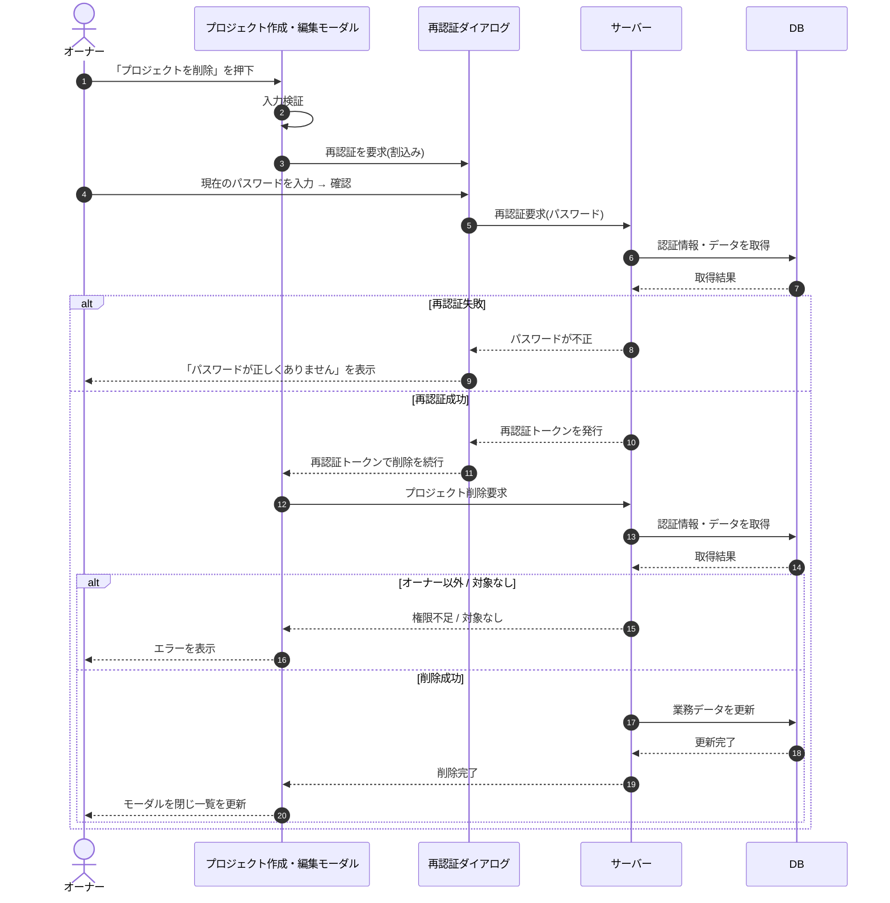

# SEQ-014: 「プロジェクトを削除」を押下

> **このページは、業務ユースケース UC-017（「プロジェクトを削除」を押下）のシーケンス図を定義します。**

| ID | 業務ユースケースID | イベント(画面ID EVT-NN) | テーブルID |
|----|----|----|----|
| SEQ-014 | [UC-017](../../01_requirements/04_business_usecases/UC-017.md#UC-017) | SCR-005 EVT-08 | [TBL-001](../02_backend/04_database/TBL-001.md#TBL-001) ・ [TBL-002](../02_backend/04_database/TBL-002.md#TBL-002) ・ [TBL-003](../02_backend/04_database/TBL-003.md#TBL-003) ・ [TBL-004](../02_backend/04_database/TBL-004.md#TBL-004) ・ [TBL-005](../02_backend/04_database/TBL-005.md#TBL-005) ・ [TBL-006](../02_backend/04_database/TBL-006.md#TBL-006) ・ [TBL-013](../02_backend/04_database/TBL-013.md#TBL-013) ・ [TBL-014](../02_backend/04_database/TBL-014.md#TBL-014) ・ [TBL-017](../02_backend/04_database/TBL-017.md#TBL-017) ・ [TBL-025](../02_backend/04_database/TBL-025.md#TBL-025) ・ [TBL-027](../02_backend/04_database/TBL-027.md#TBL-027) |

## 概要

オーナーが削除確認名称の一致と再認証ダイアログ(SCR-034)でのパスワード再認証を経てプロジェクトを論理削除する。メンバー割当を解除し、他に有効割当を持たないメンバーのアカウントを無効化したうえで、モーダルを閉じて一覧を更新する。

## シーケンス図

## 例外フロー

- 再認証でパスワードが一致しない場合、削除を中断しエラーメッセージを表示する。
- 操作者がオーナーでない場合、認可エラーとして削除を拒否する。
- 対象プロジェクトが存在しない場合、対象なしとしてエラーを表示する。

## 詳細設計への移管候補

| 内容 | 移管先候補 | 理由 |
|---|---|---|
| 関連データ(許可ドメイン / FAQ / 未解決質問 / 質問ログ)への論理削除伝播 | 詳細設計 | 基本設計ではサーバー内の業務処理に集約し、対象テーブル別の伝播手順は詳細化しないため |
| 他プロジェクトに有効割当を持たないメンバーのアカウント無効化判定 | 詳細設計 | 割当件数の評価ロジックと無効化条件は詳細設計で定義するため |
| 保持期間経過後（[システム仕様書 §4](../07_system-spec.md#4-データ保持期間削除猶予)）の物理削除バッチによる匿名化・連鎖削除 | 詳細設計 | 本同期フローの対象外であり、バッチ側の設計で扱うため |

## 備考

- 本図は基本設計レベルの抽象度(ユーザー / 画面 / サーバー、システム起点は外部システム・スケジューラ・バッチを加える)で記述する。DB 操作は DB アクターへのメッセージで表し、テーブル別 CRUD は本図に書かず 関連テーブル 欄で示す。
- 図の出典は業務ユースケース [UC-017](../../01_requirements/04_business_usecases/UC-017.md#UC-017)。画面イベントとの対応は UC-017 を参照。
