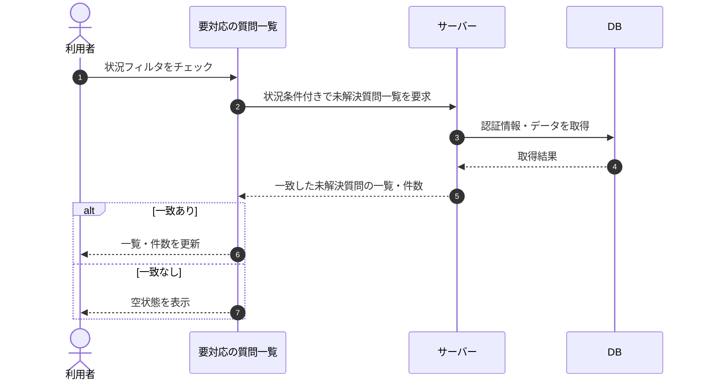

# SEQ-016: 状況フィルタをチェック

> **このページは、業務ユースケース UC-030（状況フィルタをチェック）のシーケンス図を定義します。**

## 項目

| 項目 | 内容 |
|---|---|
| SEQ ID | `SEQ-016` |
| トレーサビリティID | [TR-030](../00_traceability/index.md#TR-030) |
| 画面イベント (EVT) | SCR-006 EVT-02 |
| 関連画面 | [SCR-006](../01_frontend/01_screens/SCR-006.md#SCR-006) |
| 関連 API | [API-034](../02_backend/03_apis/API-034.md#API-034) |
| 関連テーブル | [TBL-017](../02_backend/04_database/TBL-017.md#TBL-017) |
| エラー (ERR) | — |
| メッセージ (MSG) | — |

## 概要

利用者が要対応の質問一覧で状況フィルタをチェックすると、選択した状況条件に一致する未解決質問で一覧と件数を更新する。一致が 0 件のときは空状態を表示する。

## シーケンス図

## 備考

- 本図は基本設計レベルの抽象度(ユーザー / 画面 / サーバー、システム起点は外部システム・スケジューラ・バッチを加える)で記述する。DB 操作は DB アクターへのメッセージで表し、テーブル別 CRUD は本図に書かず 関連テーブル 欄で示す。
- 図の出典は業務ユースケース [UC-030](../../01_requirements/04_business_usecases/UC-030.md#UC-030)。画面イベントとの対応は UC-030 を参照。
