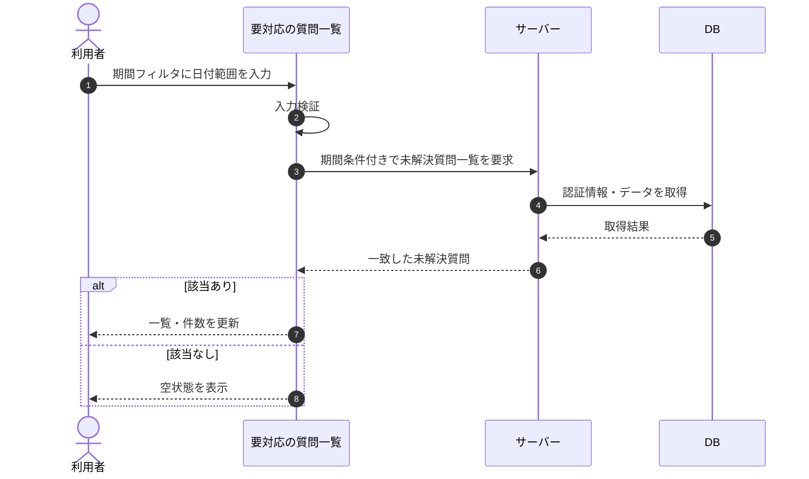

# SEQ-017: 期間フィルタを入力

> **このページは、業務ユースケース UC-029（期間フィルタを入力）のシーケンス図を定義します。**

| ID | 業務ユースケースID | イベント(画面ID EVT-NN) | テーブルID |
|----|----|----|----|
| SEQ-017 | [UC-029](../../01_requirements/04_business_usecases/UC-029.md#UC-029) | SCR-006 EVT-03 | [TBL-017](../02_backend/04_database/TBL-017.md#TBL-017) ・ [TBL-025](../02_backend/04_database/TBL-025.md#TBL-025) |

## 概要

利用者が要対応の質問一覧で期間フィルタに日付範囲を入力すると、サーバーが入力した期間に一致する未解決質問を取得し、一覧と件数を更新する。0 件のときは空状態を表示する。

## シーケンス図

## 備考

- 本図は基本設計レベルの抽象度(ユーザー / 画面 / サーバー、システム起点は外部システム・スケジューラ・バッチを加える)で記述する。DB 操作は DB アクターへのメッセージで表し、テーブル別 CRUD は本図に書かず 関連テーブル 欄で示す。
- 図の出典は業務ユースケース [UC-029](../../01_requirements/04_business_usecases/UC-029.md#UC-029)。画面イベントとの対応は UC-029 を参照。
