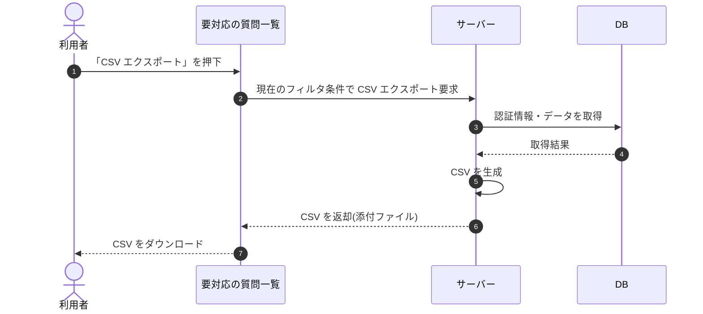

# SEQ-018: 「CSV エクスポート」を押下

> **このページは、業務ユースケース UC-030（「CSV エクスポート」を押下）のシーケンス図を定義します。**

| ID | シーケンス名 |
|----|----|
| SEQ-018 | 「CSV エクスポート」を押下 |

| 関連項目 | 内容 |
|----|----| 
| 業務ユースケース | [UC-030](../../01_requirements/04_business_usecases/UC-030.md#UC-030) |
| イベント | [SCR-006 EVT-04](../01_frontend/01_screens/SCR-006.md#SCR-006) |
| 関連画面 | [SCR-006](../01_frontend/01_screens/SCR-006.md#SCR-006) |
| 関連API | [API-036](../02_backend/03_apis/API-036.md#API-036) |
| テーブル | [TBL-017](../02_backend/04_database/TBL-017.md#TBL-017) |
| エラー(ERR) | — |
| メッセージ(MSG) | — |

## 概要

要対応の質問一覧で「CSV エクスポート」を押下すると、サーバーが現在のフィルタ条件に一致する未解決質問を全件取得し、CSV を生成して返却する。利用者はフィルタ適用結果の全件 CSV をダウンロードする。

## シーケンス図

## 備考

- 本図は基本設計レベルの抽象度(ユーザー / 画面 / サーバー、システム起点は外部システム・スケジューラ・バッチを加える)で記述する。DB 操作は DB アクターへのメッセージで表し、テーブル別 CRUD は本図に書かず 関連テーブル 欄で示す。
- 図の出典は業務ユースケース [UC-030](../../01_requirements/04_business_usecases/UC-030.md#UC-030)。画面イベントとの対応は UC-030 を参照。
