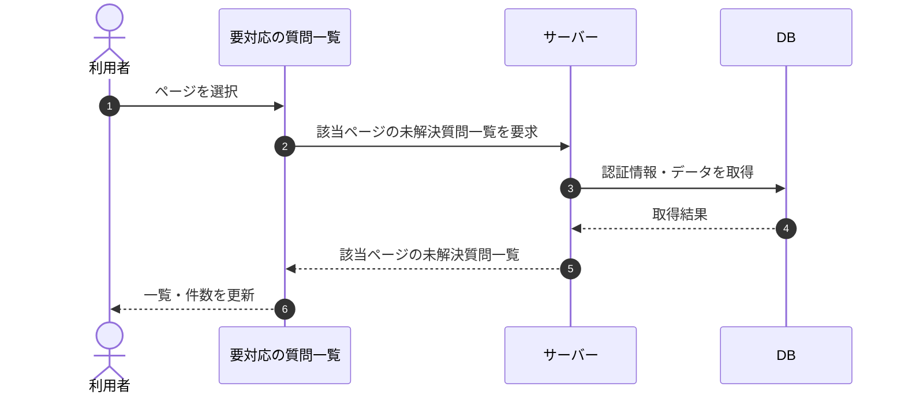

# SEQ-020: ページを選択

> **このページは、業務ユースケース UC-029（ページを選択）のシーケンス図を定義します。**

| ID | 業務ユースケースID | イベント(画面ID EVT-NN) | テーブルID |
|----|----|----|----|
| SEQ-020 | [UC-029](../../01_requirements/04_business_usecases/UC-029.md#UC-029) | SCR-006 EVT-07 | [TBL-017](../02_backend/04_database/TBL-017.md#TBL-017) ・ [TBL-025](../02_backend/04_database/TBL-025.md#TBL-025) |

## 概要

未解決質問が 2 ページ以上ある状態で、利用者がページネーションから別ページを選択すると、選択したページの未解決質問で一覧を更新する。

## シーケンス図

## 備考

- 本図は基本設計レベルの抽象度(ユーザー / 画面 / サーバー、システム起点は外部システム・スケジューラ・バッチを加える)で記述する。DB 操作は DB アクターへのメッセージで表し、テーブル別 CRUD は本図に書かず 関連テーブル 欄で示す。
- 図の出典は業務ユースケース [UC-029](../../01_requirements/04_business_usecases/UC-029.md#UC-029)。画面イベントとの対応は UC-029 を参照。
