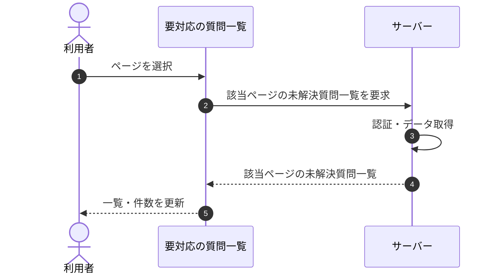

# SEQ-020: ページを選択

> **このページは、業務ユースケース UC-030（ページを選択）のシーケンス図を定義します。**

## 項目

| 項目 | 内容 |
|---|---|
| SEQ ID | `SEQ-020` |
| 対応業務ユースケース | [UC-030](../../01_requirements/04_business_usecases/UC-030.md#UC-030) |
| 業務要件 (BR) | [BR-048](../../01_requirements/01_business_requirement/02_faq-ai-br.md#BR-048) ・ [BR-145](../../01_requirements/01_business_requirement/02_faq-ai-br.md#BR-145) |
| 機能要件 (FR) | [FR-068](../../01_requirements/02_functional_requirement/02_faq-ai-fr.md#FR-068) |
| 画面イベント (EVT) | [EVT-052](../01_frontend/02_screen_events/EVT-052.md#EVT-052) |
| 関連画面 | [SCR-006](../01_frontend/01_screens/SCR-006.md#SCR-006) |
| 関連 API | [API-034](../02_backend/03_apis/API-034.md#API-034) |
| 関連テーブル | [TBL-017](../02_backend/04_database/TBL-017.md#TBL-017) |
| エラー (ERR) | — |
| メッセージ (MSG) | — |

## 概要

未解決質問が 2 ページ以上ある状態で、利用者がページネーションから別ページを選択すると、選択したページの未解決質問で一覧を更新する。

## シーケンス図

## 備考

- 本図は基本設計レベルの抽象度(ユーザー / 画面 / サーバー、システム起点は外部システム・スケジューラ・バッチを加える)で記述する。DB 操作はサーバー自己メッセージで表し、テーブル別 CRUD は本図に書かず 関連テーブル 欄で示す。
- 図の出典は業務ユースケース [UC-030](../../01_requirements/04_business_usecases/UC-030.md#UC-030)。画面イベントとの対応は UC-030 を参照。
