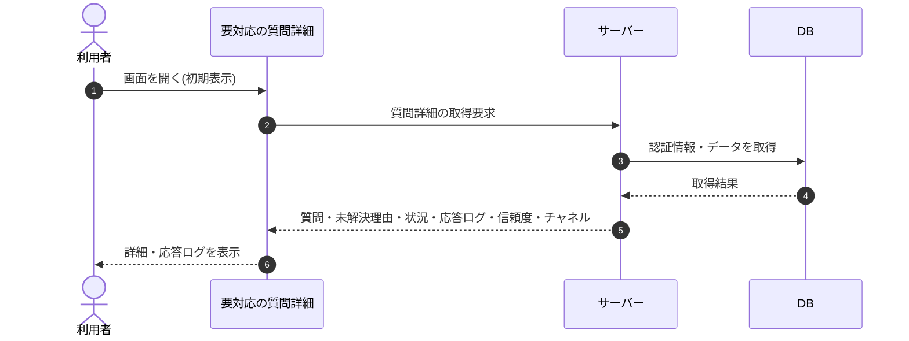

# SEQ-021: 初期表示

> **このページは、業務ユースケース UC-031（初期表示）のシーケンス図を定義します。**

## 項目

| 項目 | 内容 |
|---|---|
| SEQ ID | `SEQ-021` |
| トレーサビリティID | [TR-031](../00_traceability/index.md#TR-031) |
| 画面イベント (EVT) | EVT-043 |
| 関連画面 | [SCR-007](../01_frontend/01_screens/SCR-007.md#SCR-007) |
| 関連 API | [API-035](../02_backend/03_apis/API-035.md#API-035) |
| 関連テーブル | [TBL-006](../02_backend/04_database/TBL-006.md#TBL-006) ・ [TBL-017](../02_backend/04_database/TBL-017.md#TBL-017) ・ [TBL-025](../02_backend/04_database/TBL-025.md#TBL-025) |
| エラー (ERR) | — |
| メッセージ (MSG) | — |

## 概要

利用者が要対応の質問詳細画面を開いたときの初期表示フロー。質問本文・未解決理由・状況バッジ・応答ログ(エンドユーザー発話と AI 応答の会話履歴)・AI 信頼度・チャネルをサーバーから取得して画面に表示する。

## シーケンス図

## 備考

- 本図は基本設計レベルの抽象度(ユーザー / 画面 / サーバー、システム起点は外部システム・スケジューラ・バッチを加える)で記述する。DB 操作は DB アクターへのメッセージで表し、テーブル別 CRUD は本図に書かず 関連テーブル 欄で示す。
- 図の出典は業務ユースケース [UC-031](../../01_requirements/04_business_usecases/UC-031.md#UC-031)。画面イベントとの対応は UC-031 を参照。
