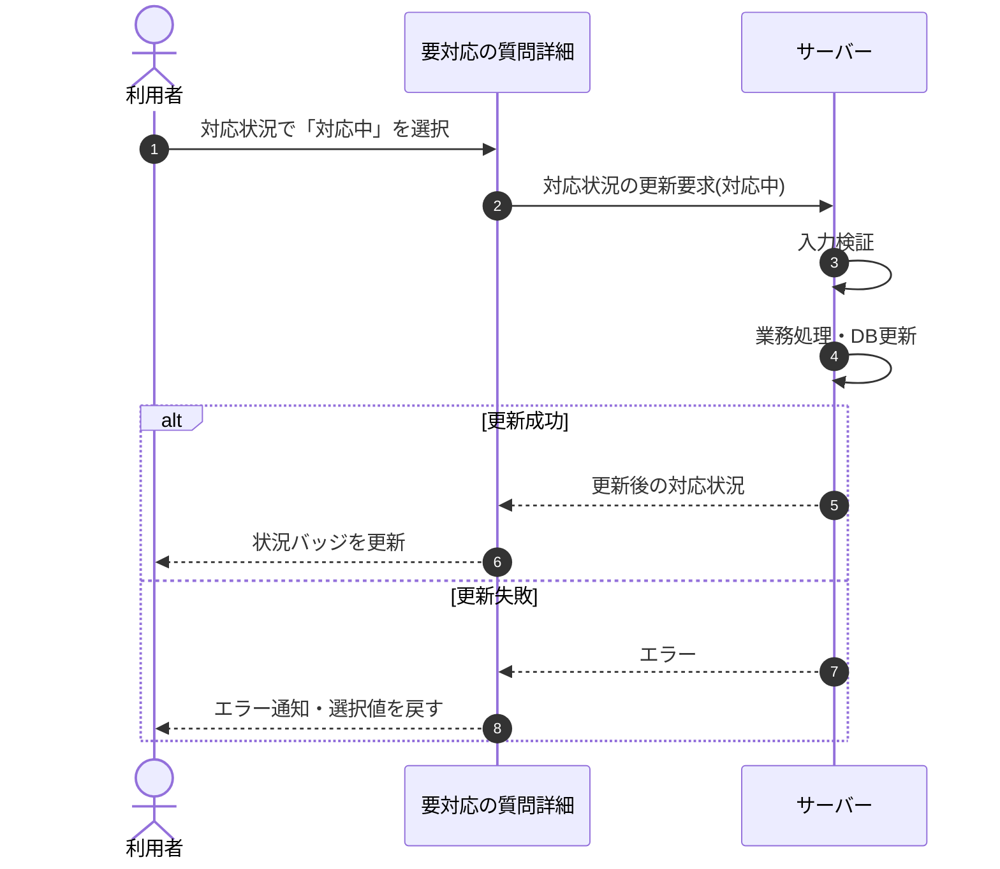

<!-- portal-top -->
[設計ポータル](../../README.md) ／ [基本設計](../index.md) ／ [シーケンス設計](index.md) ／ **SEQ-022: 「対応中」を選択**
<!-- /portal-top -->

# SEQ-022: 「対応中」を選択

> **このページは、業務ユースケース UC-032（「対応中」を選択）のシーケンス図を定義します。**

*版数 v2.0 ・ 更新 2026-06-23 ・ ステータス ドラフト*

## 項目

| 項目 | 内容 |
|---|---|
| SEQ ID | `SEQ-022` |
| 対応業務ユースケース | [UC-032](../../01_requirements/04_business_usecases/UC-032.md#UC-032) |
| 業務要件 (BR) | 要確認 |
| 機能要件 (FR) | [FR-075](../../01_requirements/02_FunctionalRequirement/02_faq-ai-fr.md#FR-075) ・ [FR-072](../../01_requirements/02_FunctionalRequirement/02_faq-ai-fr.md#FR-072) ・ [FR-073](../../01_requirements/02_FunctionalRequirement/02_faq-ai-fr.md#FR-073) ・ [FR-074](../../01_requirements/02_FunctionalRequirement/02_faq-ai-fr.md#FR-074) |
| 画面イベント (EVT) | [EVT-056](../01_frontend/02_screen_events/EVT-056.md#EVT-056) |
| 関連画面 | [SCR-007](../01_frontend/01_screens/SCR-007.md#SCR-007) |
| 関連 API | [API-035](../02_backend/03_apis/API-035.md#API-035) |
| 関連テーブル | [TBL-017](../02_backend/04_database/TBL-017.md#TBL-017) |
| エラー (ERR) | — |
| メッセージ (MSG) | 要確認 |

## 概要

要対応の質問詳細画面で対応状況に「対応中」を選択すると、対応状況を対応中に保存し、状況バッジを更新する。

## シーケンス図

## 備考

- 本図は基本設計レベルの抽象度(ユーザー / 画面 / サーバー、システム起点は外部システム・スケジューラ・バッチを加える)で記述する。DB 操作はサーバー自己メッセージで表し、テーブル別 CRUD は本図に書かず 関連テーブル 欄で示す。
- 図の出典は業務ユースケース [UC-032](../../01_requirements/04_business_usecases/UC-032.md#UC-032)。画面イベントとの対応は UC-032 を参照。

---

<!-- portal-bottom -->
[← シーケンス設計](index.md) ・ [基本設計](../index.md) ・ [↑ 設計ポータル](../../README.md)
<!-- /portal-bottom -->
