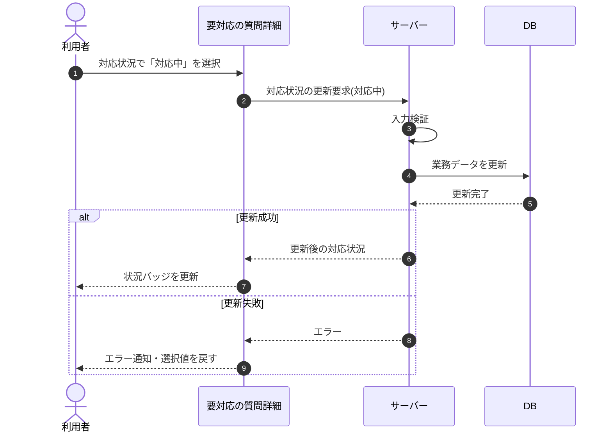

# SEQ-022: 「対応中」を選択

> **このページは、業務ユースケース UC-032（「対応中」を選択）のシーケンス図を定義します。**

## 項目

| 項目 | 内容 |
|---|---|
| SEQ ID | `SEQ-022` |
| トレーサビリティID | [TR-032](../00_traceability/index.md#TR-032) |
| 画面イベント (EVT) | — (旧イベント削除・画面再設計で再検討) |
| 関連画面 | [SCR-007](../01_frontend/01_screens/SCR-007.md#SCR-007) |
| 関連 API | [API-035](../02_backend/03_apis/API-035.md#API-035) |
| 関連テーブル | [TBL-017](../02_backend/04_database/TBL-017.md#TBL-017) |
| エラー (ERR) | — |
| メッセージ (MSG) | — |

## 概要

要対応の質問詳細画面で対応状況に「対応中」を選択すると、対応状況を対応中に保存し、状況バッジを更新する。

## シーケンス図

## 備考

- 本図は基本設計レベルの抽象度(ユーザー / 画面 / サーバー、システム起点は外部システム・スケジューラ・バッチを加える)で記述する。DB 操作は DB アクターへのメッセージで表し、テーブル別 CRUD は本図に書かず 関連テーブル 欄で示す。
- 図の出典は業務ユースケース [UC-032](../../01_requirements/04_business_usecases/UC-032.md#UC-032)。画面イベントとの対応は UC-032 を参照。
