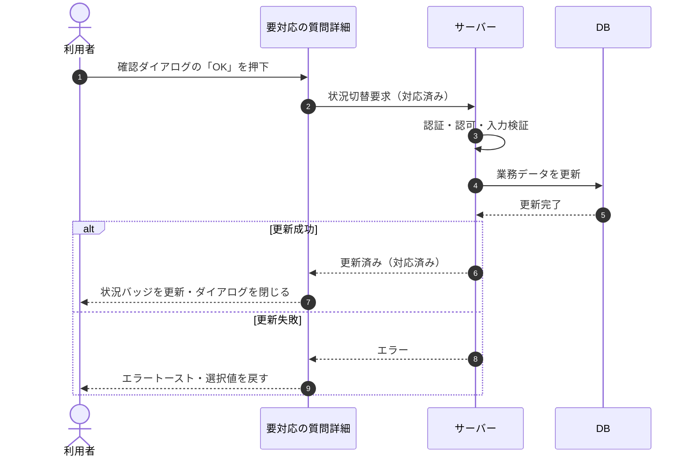

# SEQ-023: 確認ダイアログの「OK」を押下

> **このページは、業務ユースケース UC-031（確認ダイアログの「OK」を押下）のシーケンス図を定義します。**

| ID | 業務ユースケースID | イベント(画面ID EVT-NN) | テーブルID |
|----|----|----|----|
| SEQ-023 | [UC-031](../../01_requirements/04_business_usecases/UC-031.md#UC-031) | SCR-007 EVT-03 | [TBL-017](../02_backend/04_database/TBL-017.md#TBL-017) |

## 概要

要対応の質問詳細で「対応済み」を選んで表示した確認ダイアログの「OK」を押下すると、対応状況を `closed`（対応済み）に保存し、状況バッジを更新する。

## シーケンス図

## 備考

- 本図は基本設計レベルの抽象度(ユーザー / 画面 / サーバー、システム起点は外部システム・スケジューラ・バッチを加える)で記述する。DB 操作は DB アクターへのメッセージで表し、テーブル別 CRUD は本図に書かず 関連テーブル 欄で示す。
- 図の出典は業務ユースケース [UC-031](../../01_requirements/04_business_usecases/UC-031.md#UC-031)。画面イベントとの対応は UC-031 を参照。
