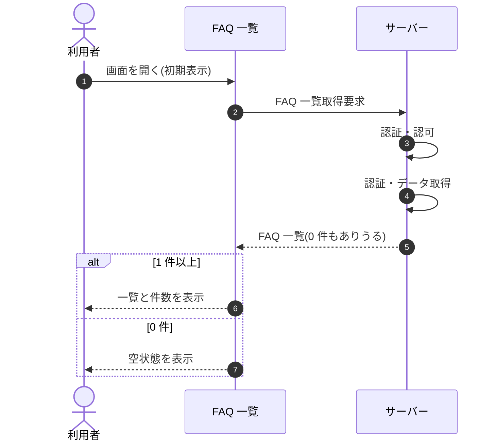

<!-- portal-top -->
[設計ポータル](../../README.md) ／ [基本設計](../index.md) ／ [シーケンス設計](index.md) ／ **SEQ-024: 初期表示**
<!-- /portal-top -->

# SEQ-024: 初期表示

> **このページは、業務ユースケース UC-024（初期表示）のシーケンス図を定義します。**

*版数 v2.0 ・ 更新 2026-06-23 ・ ステータス ドラフト*

## 項目

| 項目 | 内容 |
|---|---|
| SEQ ID | `SEQ-024` |
| 対応業務ユースケース | [UC-024](../../01_requirements/04_business_usecases/UC-024.md#UC-024) |
| 業務要件 (BR) | 要確認 |
| 機能要件 (FR) | [FR-169](../../01_requirements/02_FunctionalRequirement/04_widget-fr.md#FR-169) ・ [FR-173](../../01_requirements/02_FunctionalRequirement/03_usage-fr.md#FR-173) ・ [FR-174](../../01_requirements/02_FunctionalRequirement/03_usage-fr.md#FR-174) |
| 画面イベント (EVT) | [EVT-062](../01_frontend/02_screen_events/EVT-062.md#EVT-062) |
| 関連画面 | [SCR-008](../01_frontend/01_screens/SCR-008.md#SCR-008) |
| 関連 API | [API-025](../02_backend/03_apis/API-025.md#API-025) |
| 関連テーブル | [TBL-006](../02_backend/04_database/TBL-006.md#TBL-006) |
| エラー (ERR) | — |
| メッセージ (MSG) | 要確認 |

## 概要

FAQ 一覧画面を開いたとき、状態・プロジェクト・キーワードの条件で FAQ を取得して一覧表示する。取得結果が 0 件のときは空状態を表示する。

## シーケンス図

## 備考

- 本図は基本設計レベルの抽象度(ユーザー / 画面 / サーバー、システム起点は外部システム・スケジューラ・バッチを加える)で記述する。DB 操作はサーバー自己メッセージで表し、テーブル別 CRUD は本図に書かず 関連テーブル 欄で示す。
- 図の出典は業務ユースケース [UC-024](../../01_requirements/04_business_usecases/UC-024.md#UC-024)。画面イベントとの対応は UC-024 を参照。

---

<!-- portal-bottom -->
[← シーケンス設計](index.md) ・ [基本設計](../index.md) ・ [↑ 設計ポータル](../../README.md)
<!-- /portal-bottom -->
