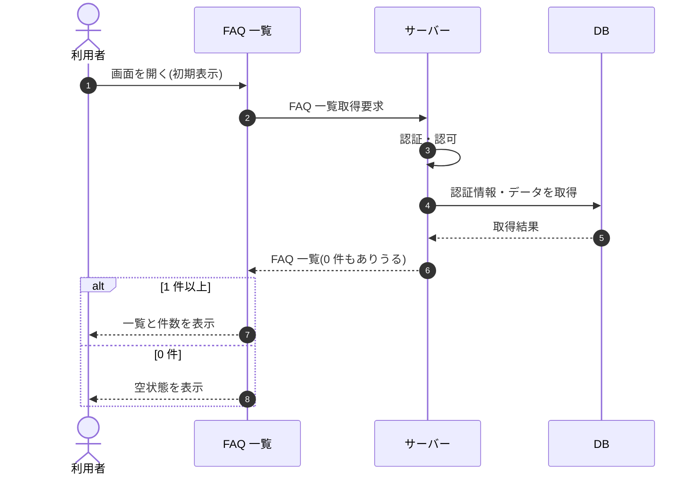

# SEQ-024: 初期表示

> **このページは、業務ユースケース UC-024（初期表示）のシーケンス図を定義します。**

## 項目

| 項目 | 内容 |
|---|---|
| SEQ ID | `SEQ-024` |
| トレーサビリティID | [TR-024](../00_traceability/index.md#TR-024) |
| 画面イベント (EVT) | EVT-048 |
| 関連画面 | [SCR-008](../01_frontend/01_screens/SCR-008.md#SCR-008) |
| 関連 API | [API-025](../02_backend/03_apis/API-025.md#API-025) |
| 関連テーブル | [TBL-006](../02_backend/04_database/TBL-006.md#TBL-006) |
| エラー (ERR) | — |
| メッセージ (MSG) | — |

## 概要

FAQ 一覧画面を開いたとき、状態・プロジェクトの条件で FAQ を取得して一覧表示する。取得結果が 0 件のときは空状態を表示する。

## シーケンス図

## 備考

- 本図は基本設計レベルの抽象度(ユーザー / 画面 / サーバー、システム起点は外部システム・スケジューラ・バッチを加える)で記述する。DB 操作は DB アクターへのメッセージで表し、テーブル別 CRUD は本図に書かず 関連テーブル 欄で示す。
- 図の出典は業務ユースケース [UC-024](../../01_requirements/04_business_usecases/UC-024.md#UC-024)。画面イベントとの対応は UC-024 を参照。
