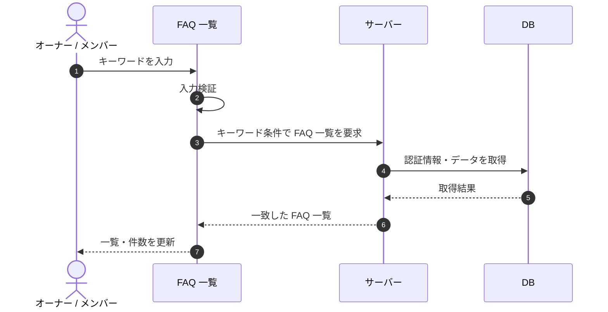

# SEQ-025: キーワードを入力

> **このページは、業務ユースケース UC-023（キーワードを入力）のシーケンス図を定義します。**

| ID | 業務ユースケースID | イベント(画面ID EVT-NN) | テーブルID |
|----|----|----|----|
| SEQ-025 | [UC-023](../../01_requirements/04_business_usecases/UC-023.md#UC-023) | SCR-008 EVT-02 | [TBL-006](../02_backend/04_database/TBL-006.md#TBL-006) ・ [TBL-030](../02_backend/04_database/TBL-030.md#TBL-030) |

## 概要

FAQ 一覧画面でキーワードを入力すると、その条件に一致する FAQ を取得して一覧と件数を更新する。

## シーケンス図

## 備考

- 本図は基本設計レベルの抽象度(ユーザー / 画面 / サーバー、システム起点は外部システム・スケジューラ・バッチを加える)で記述する。DB 操作は DB アクターへのメッセージで表し、テーブル別 CRUD は本図に書かず 関連テーブル 欄で示す。
- 図の出典は業務ユースケース [UC-023](../../01_requirements/04_business_usecases/UC-023.md#UC-023)。画面イベントとの対応は UC-023 を参照。
