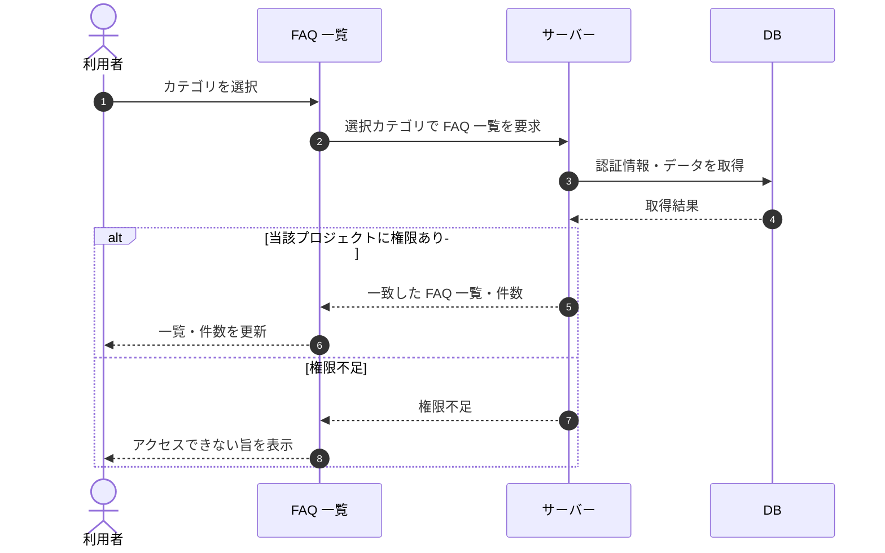

# SEQ-026: カテゴリを選択

> **このページは、業務ユースケース UC-023（カテゴリを選択）のシーケンス図を定義します。**

| ID | 業務ユースケースID | イベント(画面ID EVT-NN) | テーブルID |
|----|----|----|----|
| SEQ-026 | [UC-023](../../01_requirements/04_business_usecases/UC-023.md#UC-023) | SCR-008 EVT-03 | [TBL-006](../02_backend/04_database/TBL-006.md#TBL-006) ・ [TBL-030](../02_backend/04_database/TBL-030.md#TBL-030) |

## 概要

FAQ 一覧画面でカテゴリを選択すると、選択したカテゴリを絞り込み条件としてサーバーへ一覧取得を要求し、一致する FAQ で一覧と件数を更新する。

## シーケンス図

## 例外フロー

- 当該プロジェクトへのアクセス権限がない場合は権限不足として扱い、一覧を更新せずエラーを表示する。

## 備考

- 本図は基本設計レベルの抽象度(ユーザー / 画面 / サーバー、システム起点は外部システム・スケジューラ・バッチを加える)で記述する。DB 操作は DB アクターへのメッセージで表し、テーブル別 CRUD は本図に書かず 関連テーブル 欄で示す。
- 図の出典は業務ユースケース [UC-023](../../01_requirements/04_business_usecases/UC-023.md#UC-023)。画面イベントとの対応は UC-023 を参照。
