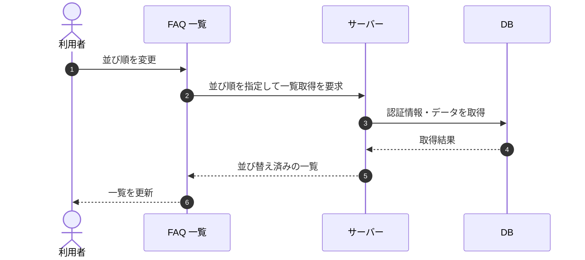

# SEQ-027: 並び順を変更

> **このページは、業務ユースケース UC-024（並び順を変更）のシーケンス図を定義します。**

## 項目

| 項目 | 内容 |
|---|---|
| SEQ ID | `SEQ-027` |
| 対応業務ユースケース | [UC-024](../../01_requirements/04_business_usecases/UC-024.md#UC-024) |
| 業務要件 (BR) | [BR-031](../../01_requirements/01_business_requirement/02_faq-ai-br.md#BR-031) |
| 機能要件 (FR) | [FR-169](../../01_requirements/02_functional_requirement/04_widget-fr.md#FR-169) ・ [FR-173](../../01_requirements/02_functional_requirement/03_usage-fr.md#FR-173) ・ [FR-174](../../01_requirements/02_functional_requirement/03_usage-fr.md#FR-174) |
| 画面イベント (EVT) | EVT-065 |
| 関連画面 | [SCR-008](../01_frontend/01_screens/SCR-008.md#SCR-008) |
| 関連 API | [API-025](../02_backend/03_apis/API-025.md#API-025) |
| 関連テーブル | [TBL-006](../02_backend/04_database/TBL-006.md#TBL-006) |
| エラー (ERR) | — |
| メッセージ (MSG) | — |

## 概要

FAQ 一覧画面で利用者が並び順（関連度 / 更新日時 / 作成日時）を選択すると、サーバーは指定された並び順で FAQ を取得し、一覧を更新する。

## シーケンス図

## 備考

- 本図は基本設計レベルの抽象度(ユーザー / 画面 / サーバー、システム起点は外部システム・スケジューラ・バッチを加える)で記述する。DB 操作は DB アクターへのメッセージで表し、テーブル別 CRUD は本図に書かず 関連テーブル 欄で示す。
- 図の出典は業務ユースケース [UC-024](../../01_requirements/04_business_usecases/UC-024.md#UC-024)。画面イベントとの対応は UC-024 を参照。
