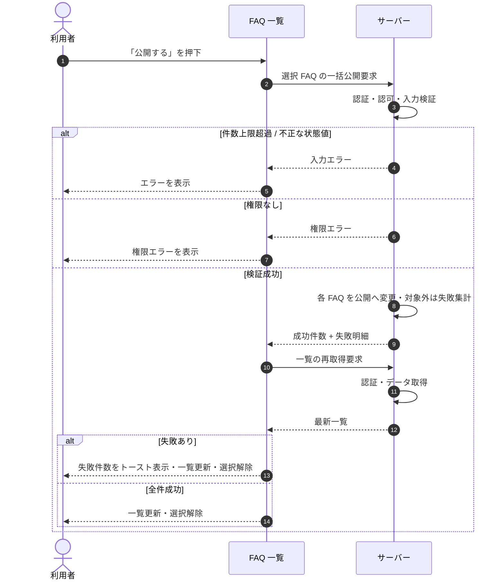

<!-- portal-top -->
[設計ポータル](../../README.md) ／ [基本設計](../index.md) ／ [シーケンス設計](index.md) ／ **SEQ-028: 「公開する」を押下**
<!-- /portal-top -->

# SEQ-028: 「公開する」を押下

> **このページは、業務ユースケース UC-027（「公開する」を押下）のシーケンス図を定義します。**

*版数 v2.0 ・ 更新 2026-06-23 ・ ステータス ドラフト*

## 項目

| 項目 | 内容 |
|---|---|
| SEQ ID | `SEQ-028` |
| 対応業務ユースケース | [UC-027](../../01_requirements/04_business_usecases/UC-027.md#UC-027) |
| 業務要件 (BR) | [BR-028](../../01_requirements/01_BusinessRequirement/02_faq-ai-br.md#BR-028) ・ [BR-030](../../01_requirements/01_BusinessRequirement/02_faq-ai-br.md#BR-030) |
| 機能要件 (FR) | [FR-169](../../01_requirements/02_FunctionalRequirement/04_widget-fr.md#FR-169) ・ [FR-173](../../01_requirements/02_FunctionalRequirement/03_usage-fr.md#FR-173) ・ [FR-174](../../01_requirements/02_FunctionalRequirement/03_usage-fr.md#FR-174) |
| 画面イベント (EVT) | [EVT-069](../01_frontend/02_screen_events/EVT-069.md#EVT-069) |
| 関連画面 | [SCR-008](../01_frontend/01_screens/SCR-008.md#SCR-008) |
| 関連 API | [API-025](../02_backend/03_apis/API-025.md#API-025) ・ [API-027](../02_backend/03_apis/API-027.md#API-027) |
| 関連テーブル | [TBL-006](../02_backend/04_database/TBL-006.md#TBL-006) |
| エラー (ERR) | [ERR-001](../05_errors/ERR-001.md#ERR-001) ・ [ERR-021](../05_errors/ERR-021.md#ERR-021) |
| メッセージ (MSG) | — |

## 概要

選択した複数の FAQ を一括で公開状態へ変更する。サーバーは行単位で変更し、成功件数と失敗明細を返したのち画面が一覧を再取得し、選択を解除する。

## シーケンス図

## 例外フロー

- 1 リクエストの件数上限を超過、または不正な状態値が指定された場合は入力エラーを返す。
- 当該プロジェクトへの権限がない場合は権限エラーを返す。
- 指定 FAQ が対象外（他契約 / 論理削除済み）の行は当該行のみ失敗として集計し、成功件数とともに失敗明細を返す。

## 備考

- 本図は基本設計レベルの抽象度(ユーザー / 画面 / サーバー、システム起点は外部システム・スケジューラ・バッチを加える)で記述する。DB 操作はサーバー自己メッセージで表し、テーブル別 CRUD は本図に書かず 関連テーブル 欄で示す。
- 図の出典は業務ユースケース [UC-027](../../01_requirements/04_business_usecases/UC-027.md#UC-027)。画面イベントとの対応は UC-027 を参照。

---

<!-- portal-bottom -->
[← シーケンス設計](index.md) ・ [基本設計](../index.md) ・ [↑ 設計ポータル](../../README.md)
<!-- /portal-bottom -->
