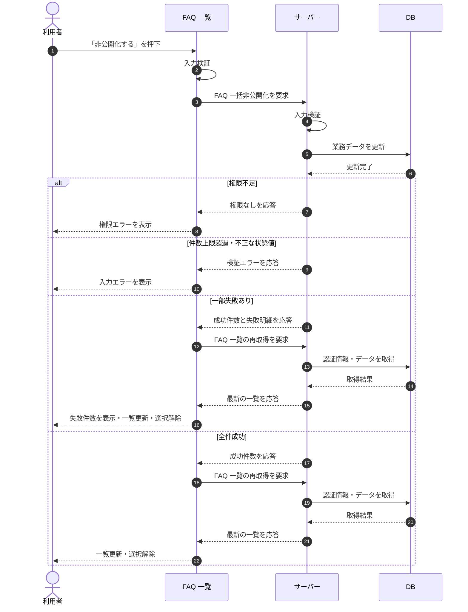

# SEQ-029: 「非公開化する」を押下

> **このページは、業務ユースケース UC-026（「非公開化する」を押下）のシーケンス図を定義します。**

| ID | 業務ユースケースID | イベント(画面ID EVT-NN) | テーブルID |
|----|----|----|----|
| SEQ-029 | [UC-026](../../01_requirements/04_business_usecases/UC-026.md#UC-026) | SCR-008 EVT-09 | [TBL-006](../02_backend/04_database/TBL-006.md#TBL-006) |

## 概要

FAQ 一覧で選択した複数の FAQ を、一括操作バーの「非公開化する」押下により一括で非公開状態へ変更する。サーバーで状態を更新後、一覧を再取得し選択を解除する。

## シーケンス図

## 例外フロー

- 当該プロジェクトへの権限がない場合は権限エラーを表示し、状態を変更しない。
- 1 リクエストの件数上限を超過、または不正な状態値の場合は入力エラーを表示する。
- 対象外の FAQ（他プロジェクト / 論理削除済み）は当該行のみ失敗として集計し、失敗件数を一覧上で通知する。

## 備考

- 本図は基本設計レベルの抽象度(ユーザー / 画面 / サーバー、システム起点は外部システム・スケジューラ・バッチを加える)で記述する。DB 操作は DB アクターへのメッセージで表し、テーブル別 CRUD は本図に書かず 関連テーブル 欄で示す。
- 図の出典は業務ユースケース [UC-026](../../01_requirements/04_business_usecases/UC-026.md#UC-026)。画面イベントとの対応は UC-026 を参照。
