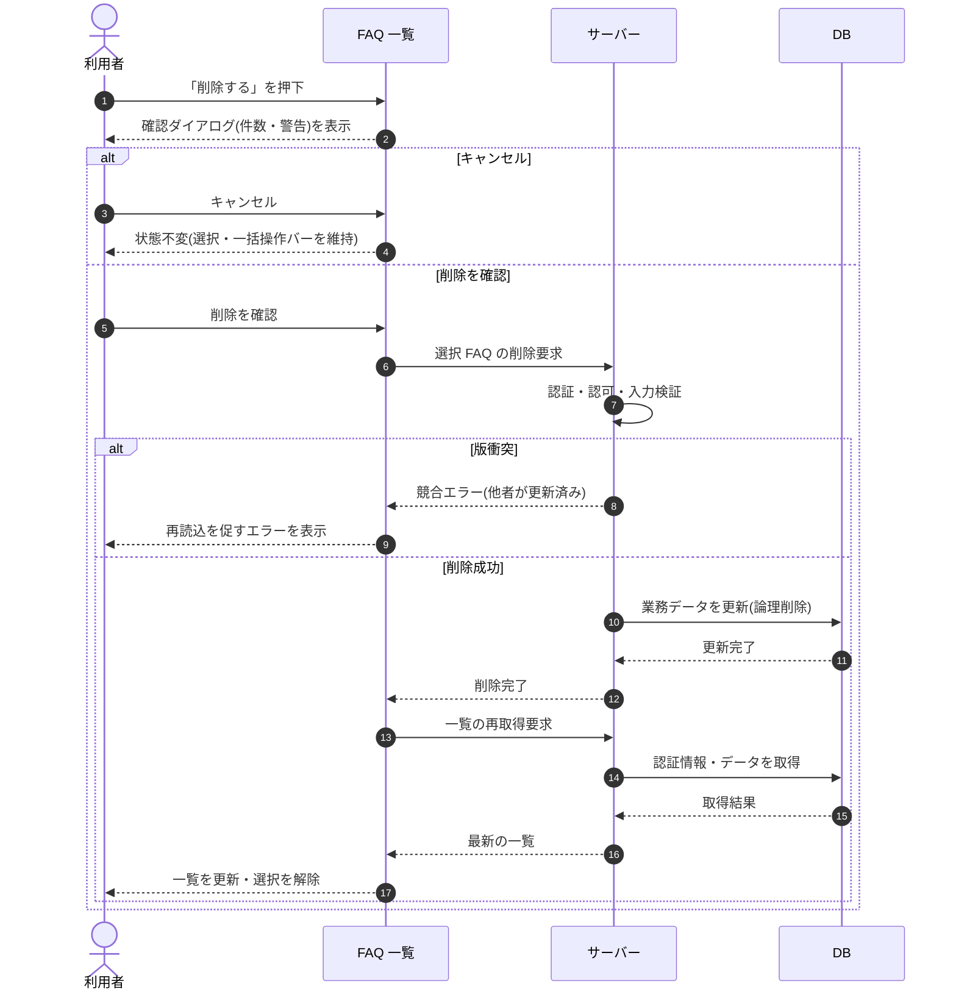

# SEQ-030: 「削除する」を押下

> **このページは、業務ユースケース UC-026（「削除する」を押下）のシーケンス図を定義します。**

| ID | シーケンス名 |
|----|----|
| SEQ-030 | 「削除する」を押下 |

| 関連項目 | 内容 |
|----|----| 
| 業務ユースケース | [UC-026](../../01_requirements/04_business_usecases/UC-026.md#UC-026) |
| イベント | [SCR-008 EVT-10](../01_frontend/01_screens/SCR-008.md#SCR-008) |
| 関連画面 | [SCR-008](../01_frontend/01_screens/SCR-008.md#SCR-008) |
| 関連API | [API-025](../02_backend/03_apis/API-025.md#API-025) / [API-026](../02_backend/03_apis/API-026.md#API-026) |
| テーブル | [TBL-006](../02_backend/04_database/TBL-006.md#TBL-006) |
| エラー(ERR) | [ERR-001](../05_errors/ERR-001.md#ERR-001) / [ERR-023](../05_errors/ERR-023.md#ERR-023) |
| メッセージ(MSG) | — |

## 概要

選択中の FAQ について確認ダイアログで意思確認したうえで論理削除する。削除後は一覧を再取得して最新化し、選択状態を解除する。

## シーケンス図

## 例外フロー

- 楽観ロック競合(他者が対象 FAQ を更新済み)の場合は削除を中止し、再読込を促すエラーを表示する。
- 認証・認可エラー(権限なし)の場合は削除を実行せずエラーを返す。

## 備考

- 本図は基本設計レベルの抽象度(ユーザー / 画面 / サーバー、システム起点は外部システム・スケジューラ・バッチを加える)で記述する。DB 操作は DB アクターへのメッセージで表し、テーブル別 CRUD は本図に書かず 関連テーブル 欄で示す。
- 図の出典は業務ユースケース [UC-026](../../01_requirements/04_business_usecases/UC-026.md#UC-026)。画面イベントとの対応は UC-026 を参照。
