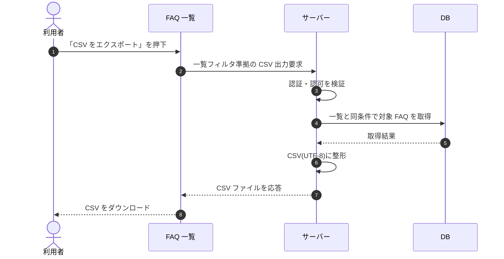

# SEQ-031: 「CSV をエクスポート」を押下

> **このページは、業務ユースケース UC-028（「CSV をエクスポート」を押下）のシーケンス図を定義します。**

| ID | シーケンス名 |
|----|----|
| SEQ-031 | 「CSV をエクスポート」を押下 |

| 関連項目 | 内容 |
|----|----| 
| 業務ユースケース | [UC-028](../../01_requirements/04_business_usecases/UC-028.md#UC-028) |
| イベント | [SCR-008 EVT-13](../01_frontend/01_screens/SCR-008.md#SCR-008) |
| 関連画面 | [SCR-008](../01_frontend/01_screens/SCR-008.md#SCR-008) |
| 関連API | [API-030](../02_backend/03_apis/API-030.md#API-030) |
| テーブル | [TBL-006](../02_backend/04_database/TBL-006.md#TBL-006) |
| エラー(ERR) | — |
| メッセージ(MSG) | — |

## 概要

FAQ 一覧画面で「CSV をエクスポート」を押下すると、一覧フィルタ適用結果の FAQ を取得し、CSV（UTF-8）として整形してダウンロードする。

## シーケンス図

## 備考

- 本図は基本設計レベルの抽象度(ユーザー / 画面 / サーバー、システム起点は外部システム・スケジューラ・バッチを加える)で記述する。DB 操作は DB アクターへのメッセージで表し、テーブル別 CRUD は本図に書かず 関連テーブル 欄で示す。
- 図の出典は業務ユースケース [UC-028](../../01_requirements/04_business_usecases/UC-028.md#UC-028)。画面イベントとの対応は UC-028 を参照。
