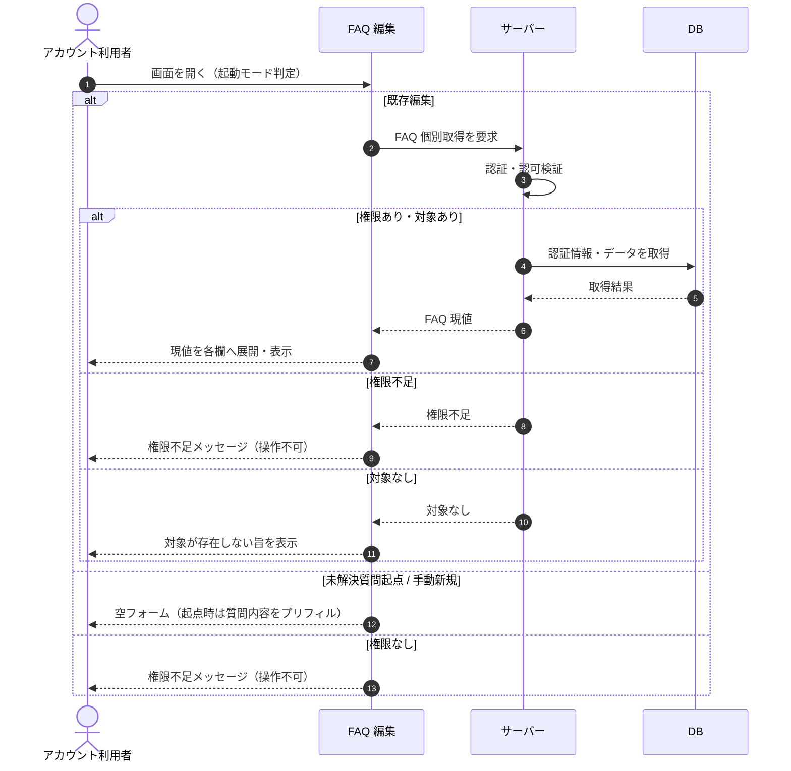

# SEQ-032: 初期表示

> **このページは、業務ユースケース UC-024（初期表示）のシーケンス図を定義します。**

| ID | 業務ユースケースID | イベント(画面ID EVT-NN) | テーブルID |
|----|----|----|----|
| SEQ-032 | [UC-024](../../01_requirements/04_business_usecases/UC-024.md#UC-024) | SCR-009 EVT-01 | [TBL-006](../02_backend/04_database/TBL-006.md#TBL-006) ・ [TBL-017](../02_backend/04_database/TBL-017.md#TBL-017) ・ [TBL-029](../02_backend/04_database/TBL-029.md#TBL-029) |

## 概要

アカウント利用者が FAQ 編集画面を開いたとき、起動モード（既存編集 / 未解決質問起点 / 手動新規）に応じたフォームを表示する。既存編集では指定 FAQ の現値を取得して各欄へ展開し、権限がない場合は権限不足メッセージを表示して操作不可とする。

## シーケンス図

## 例外フロー

- 当該プロジェクトへの権限がない場合は、権限不足メッセージを表示して操作不可とする（[ERR-019](../05_errors/ERR-019.md#ERR-019)）。
- 指定した FAQ が存在しない / 論理削除済みの場合は、対象が存在しない旨を表示する（[ERR-017](../05_errors/ERR-017.md#ERR-017)）。

## 備考

- 本図は基本設計レベルの抽象度（ユーザー / 画面 / サーバー、システム起点は外部システム・スケジューラ・バッチを加える）で記述する。DB 操作は DB アクターへのメッセージで表し、テーブル別 CRUD は本図に書かず 関連テーブル 欄で示す。
- 図の出典は業務ユースケース [UC-024](../../01_requirements/04_business_usecases/UC-024.md#UC-024)。画面イベントとの対応は UC-024 を参照。
