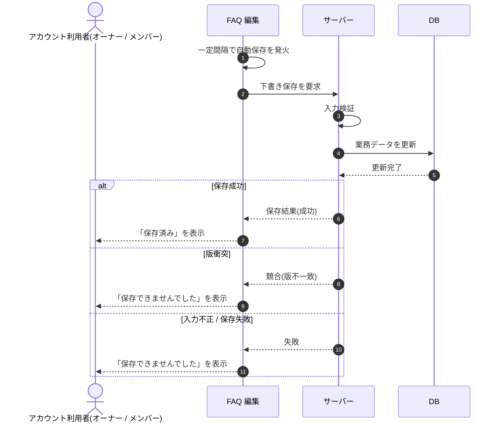

# SEQ-033: 自動保存

> **このページは、業務ユースケース UC-025（自動保存）のシーケンス図を定義します。**

## 項目

| 項目 | 内容 |
|---|---|
| SEQ ID | `SEQ-033` |
| トレーサビリティID | [TR-025](../00_traceability/index.md#TR-025) |
| 画面イベント (EVT) | EVT-064 |
| 関連画面 | [SCR-009](../01_frontend/01_screens/SCR-009.md#SCR-009) |
| 関連 API | [API-026](../02_backend/03_apis/API-026.md#API-026) |
| 関連テーブル | — |
| エラー (ERR) | [ERR-001](../05_errors/ERR-001.md#ERR-001) ・ [ERR-025](../05_errors/ERR-025.md#ERR-025) |
| メッセージ (MSG) | — |

## 概要

編集中の FAQ を自動保存タイマーが一定間隔で発火させ、下書きをサーバーへ保存する。成功時は自動保存インジケータが「保存済み」に、失敗時は「保存できませんでした」に更新される。

## シーケンス図

## 例外フロー

- 楽観ロックの版が一致しない場合は競合として保存を中断し、インジケータを「保存できませんでした」に更新する。
- 入力値が制約(質問・回答の文字数等)に違反する場合は保存せず、インジケータを「保存できませんでした」に更新する。

## 詳細設計への移管候補

| 内容 | 移管先候補 | 理由 |
|---|---|---|
| 自動保存タイマーの発火間隔と多重発火の抑止 | 詳細設計 | 基本設計では相互作用に限定し、間隔値・デバウンス制御は実装詳細のため。 |
| `version` による楽観ロックの版管理 | 詳細設計 | 版採番・比較・再取得手順は実装詳細のため。 |

## 備考

- 本図は基本設計レベルの抽象度(ユーザー / 画面 / サーバー、システム起点は外部システム・スケジューラ・バッチを加える)で記述する。DB 操作は DB アクターへのメッセージで表し、テーブル別 CRUD は本図に書かず 関連テーブル 欄で示す。
- 図の出典は業務ユースケース [UC-025](../../01_requirements/04_business_usecases/UC-025.md#UC-025)。画面イベントとの対応は UC-025 を参照。
