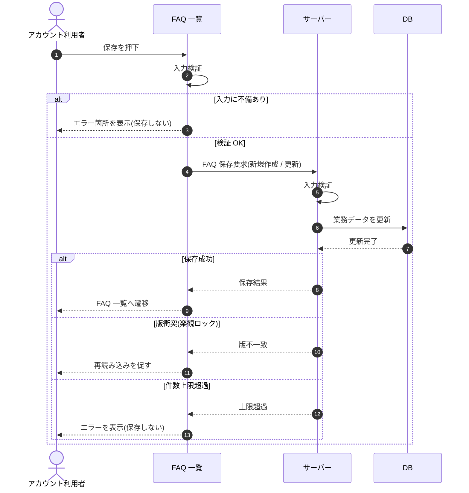

# SEQ-034: 保存

> **このページは、業務ユースケース UC-025（保存）のシーケンス図を定義します。**

## 項目

| 項目 | 内容 |
|---|---|
| SEQ ID | `SEQ-034` |
| 対応業務ユースケース | [UC-025](../../01_requirements/04_business_usecases/UC-025.md#UC-025) |
| 業務要件 (BR) | [BR-028](../../01_requirements/01_business_requirement/02_faq-ai-br.md#BR-028) ・ [BR-030](../../01_requirements/01_business_requirement/02_faq-ai-br.md#BR-030) ・ [BR-032](../../01_requirements/01_business_requirement/02_faq-ai-br.md#BR-032) ・ [BR-033](../../01_requirements/01_business_requirement/02_faq-ai-br.md#BR-033) ・ [BR-034](../../01_requirements/01_business_requirement/02_faq-ai-br.md#BR-034) ・ [BR-049](../../01_requirements/01_business_requirement/02_faq-ai-br.md#BR-049) |
| 機能要件 (FR) | [FR-047](../../01_requirements/02_functional_requirement/02_faq-ai-fr.md#FR-047) ・ [FR-053](../../01_requirements/02_functional_requirement/02_faq-ai-fr.md#FR-053) |
| 画面イベント (EVT) | EVT-082 |
| 関連画面 | [SCR-008](../01_frontend/01_screens/SCR-008.md#SCR-008) ・ [SCR-009](../01_frontend/01_screens/SCR-009.md#SCR-009) |
| 関連 API | [API-026](../02_backend/03_apis/API-026.md#API-026) |
| 関連テーブル | — |
| エラー (ERR) | [ERR-001](../05_errors/ERR-001.md#ERR-001) ・ [ERR-025](../05_errors/ERR-025.md#ERR-025) |
| メッセージ (MSG) | — |

## 概要

アカウント利用者が FAQ の保存を実行し、入力検証後に FAQ を新規作成または更新して FAQ 一覧へ遷移する。版衝突・件数上限超過時は遷移せずエラーを表示する。

## シーケンス図

## 例外フロー

- 入力検証エラー: 質問・回答の必須範囲を満たさない場合は保存せずエラー箇所を表示する。
- 版衝突: 他者の更新と版が一致しない場合は保存せず、再読み込みを促す。
- 件数上限超過: FAQ 件数が上限を超える場合は保存せずエラーを表示する。

## 備考

- 本図は基本設計レベルの抽象度(ユーザー / 画面 / サーバー、システム起点は外部システム・スケジューラ・バッチを加える)で記述する。DB 操作は DB アクターへのメッセージで表し、テーブル別 CRUD は本図に書かず 関連テーブル 欄で示す。
- 図の出典は業務ユースケース [UC-025](../../01_requirements/04_business_usecases/UC-025.md#UC-025)。画面イベントとの対応は UC-025 を参照。
