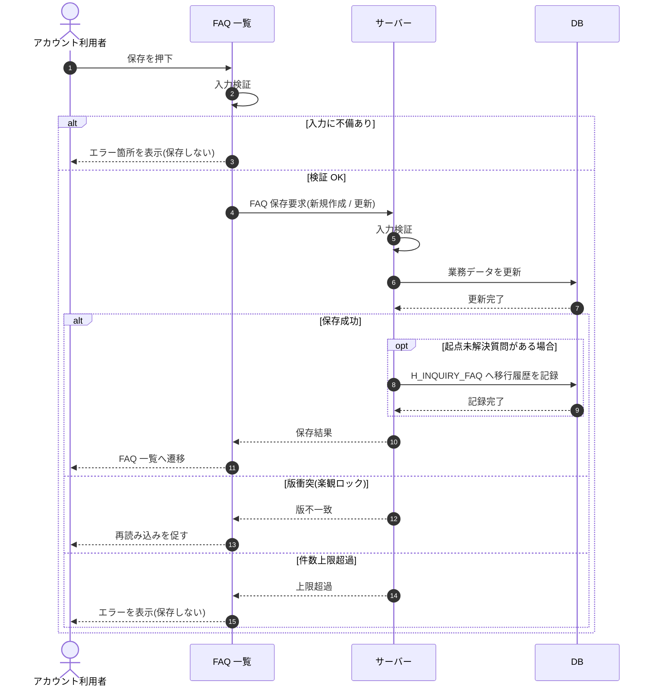

# SEQ-034: 保存

> **このページは、業務ユースケース UC-024（保存）のシーケンス図を定義します。**

| ID | 業務ユースケースID | イベント(画面ID EVT-NN) | テーブルID |
|----|----|----|----|
| SEQ-034 | [UC-024](../../01_requirements/04_business_usecases/UC-024.md#UC-024) | SCR-009 EVT-04 | [TBL-006](../02_backend/04_database/TBL-006.md#TBL-006) ・ [TBL-017](../02_backend/04_database/TBL-017.md#TBL-017) ・ [TBL-029](../02_backend/04_database/TBL-029.md#TBL-029) |

## 概要

アカウント利用者が FAQ の保存を実行し、入力検証後に FAQ を新規作成または更新して FAQ 一覧へ遷移する。版衝突・件数上限超過時は遷移せずエラーを表示する。

## シーケンス図

## 例外フロー

- 入力検証エラー: 質問・回答の必須範囲を満たさない場合は保存せずエラー箇所を表示する。
- 版衝突: 他者の更新と版が一致しない場合は保存せず、再読み込みを促す。
- 件数上限超過: FAQ 件数が上限を超える場合は保存せずエラーを表示する。

## 備考

- 本図は基本設計レベルの抽象度(ユーザー / 画面 / サーバー、システム起点は外部システム・スケジューラ・バッチを加える)で記述する。DB 操作は DB アクターへのメッセージで表し、テーブル別 CRUD は本図に書かず 関連テーブル 欄で示す。
- 図の出典は業務ユースケース [UC-024](../../01_requirements/04_business_usecases/UC-024.md#UC-024)。画面イベントとの対応は UC-024 を参照。
