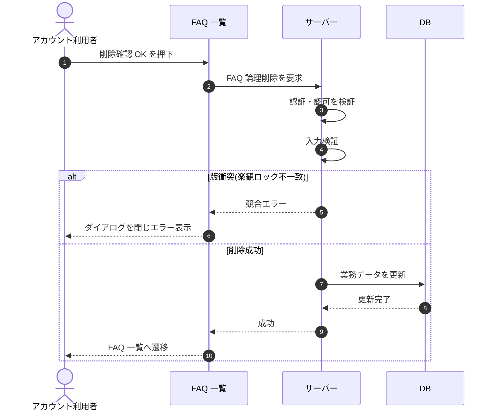

# SEQ-035: 削除確認 OK

> **このページは、業務ユースケース UC-025（削除確認 OK）のシーケンス図を定義します。**

| ID | 業務ユースケースID | イベント(画面ID EVT-NN) | テーブルID |
|----|----|----|----|
| SEQ-035 | [UC-025](../../01_requirements/04_business_usecases/UC-025.md#UC-025) | SCR-009 EVT-06 | [TBL-006](../02_backend/04_database/TBL-006.md#TBL-006) ・ [TBL-017](../02_backend/04_database/TBL-017.md#TBL-017) |

## 概要

アカウント利用者が削除確認ダイアログで OK を押下すると、対象 FAQ を論理削除する。成功時は FAQ 一覧へ遷移し、失敗時はダイアログを閉じてエラーを表示する。

## シーケンス図

## 例外フロー

- 楽観ロック競合(`version` 不一致)時は削除を中断し、ダイアログを閉じてエラーを表示する（[ERR-023](../05_errors/ERR-023.md#ERR-023)）。
- 入力検証エラー時は削除を中断し、エラーを表示する（[ERR-001](../05_errors/ERR-001.md#ERR-001)）。

## 備考

- 本図は基本設計レベルの抽象度(ユーザー / 画面 / サーバー、システム起点は外部システム・スケジューラ・バッチを加える)で記述する。DB 操作は DB アクターへのメッセージで表し、テーブル別 CRUD は本図に書かず 関連テーブル 欄で示す。
- 図の出典は業務ユースケース [UC-025](../../01_requirements/04_business_usecases/UC-025.md#UC-025)。画面イベントとの対応は UC-025 を参照。
