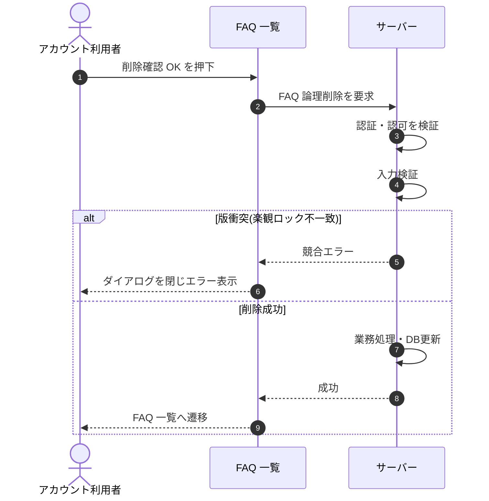

# SEQ-035: 削除確認 OK

> **このページは、業務ユースケース UC-026（削除確認 OK）のシーケンス図を定義します。**

## 項目

| 項目 | 内容 |
|---|---|
| SEQ ID | `SEQ-035` |
| 対応業務ユースケース | [UC-026](../../01_requirements/04_business_usecases/UC-026.md#UC-026) |
| 業務要件 (BR) | [BR-028](../../01_requirements/01_business_requirement/02_faq-ai-br.md#BR-028) ・ [BR-029](../../01_requirements/01_business_requirement/02_faq-ai-br.md#BR-029) |
| 機能要件 (FR) | [FR-053](../../01_requirements/02_functional_requirement/02_faq-ai-fr.md#FR-053) ・ [FR-047](../../01_requirements/02_functional_requirement/02_faq-ai-fr.md#FR-047) ・ [FR-169](../../01_requirements/02_functional_requirement/04_widget-fr.md#FR-169) |
| 画面イベント (EVT) | [EVT-084](../01_frontend/02_screen_events/EVT-084.md#EVT-084) |
| 関連画面 | [SCR-008](../01_frontend/01_screens/SCR-008.md#SCR-008) ・ [SCR-009](../01_frontend/01_screens/SCR-009.md#SCR-009) |
| 関連 API | [API-026](../02_backend/03_apis/API-026.md#API-026) |
| 関連テーブル | — |
| エラー (ERR) | [ERR-001](../05_errors/ERR-001.md#ERR-001) ・ [ERR-025](../05_errors/ERR-025.md#ERR-025) |
| メッセージ (MSG) | — |

## 概要

アカウント利用者が削除確認ダイアログで OK を押下すると、対象 FAQ を論理削除する。成功時は FAQ 一覧へ遷移し、失敗時はダイアログを閉じてエラーを表示する。

## シーケンス図

## 例外フロー

- 楽観ロック競合(`version` 不一致)時は削除を中断し、ダイアログを閉じてエラーを表示する（[ERR-025](../05_errors/ERR-025.md#ERR-025)）。
- 入力検証エラー時は削除を中断し、エラーを表示する（[ERR-001](../05_errors/ERR-001.md#ERR-001)）。

## 備考

- 本図は基本設計レベルの抽象度(ユーザー / 画面 / サーバー、システム起点は外部システム・スケジューラ・バッチを加える)で記述する。DB 操作はサーバー自己メッセージで表し、テーブル別 CRUD は本図に書かず 関連テーブル 欄で示す。
- 図の出典は業務ユースケース [UC-026](../../01_requirements/04_business_usecases/UC-026.md#UC-026)。画面イベントとの対応は UC-026 を参照。
