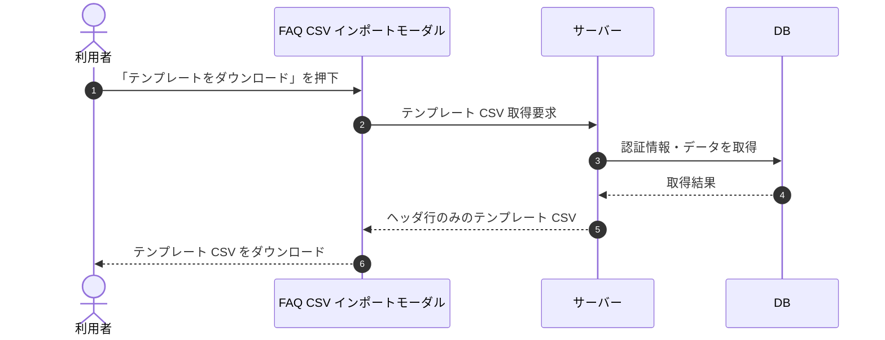

# SEQ-036: 「テンプレートをダウンロード」を押下

> **このページは、業務ユースケース UC-028（「テンプレートをダウンロード」を押下）のシーケンス図を定義します。**

## 項目

| 項目 | 内容 |
|---|---|
| SEQ ID | `SEQ-036` |
| トレーサビリティID | [TR-028](../00_traceability/index.md#TR-028) |
| 画面イベント (EVT) | EVT-074 |
| 関連画面 | [SCR-010](../01_frontend/01_screens/SCR-010.md#SCR-010) |
| 関連 API | [API-029](../02_backend/03_apis/API-029.md#API-029) |
| 関連テーブル | — |
| エラー (ERR) | — |
| メッセージ (MSG) | — |

## 概要

CSV インポートモーダルでテンプレートのダウンロードを押下し、ヘッダ行のみのテンプレート CSV をダウンロードする。

## シーケンス図

## 備考

- 本図は基本設計レベルの抽象度(ユーザー / 画面 / サーバー、システム起点は外部システム・スケジューラ・バッチを加える)で記述する。DB 操作は DB アクターへのメッセージで表し、テーブル別 CRUD は本図に書かず 関連テーブル 欄で示す。
- 図の出典は業務ユースケース [UC-028](../../01_requirements/04_business_usecases/UC-028.md#UC-028)。画面イベントとの対応は UC-028 を参照。
