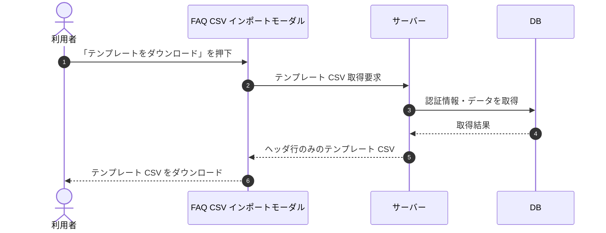

# SEQ-036: 「テンプレートをダウンロード」を押下

> **このページは、業務ユースケース UC-027（「テンプレートをダウンロード」を押下）のシーケンス図を定義します。**

| ID | 業務ユースケースID | イベント(画面ID EVT-NN) | テーブルID |
|----|----|----|----|
| SEQ-036 | [UC-027](../../01_requirements/04_business_usecases/UC-027.md#UC-027) | SCR-010 EVT-02 | [TBL-006](../02_backend/04_database/TBL-006.md#TBL-006) |

## 概要

CSV インポートモーダルでテンプレートのダウンロードを押下し、ヘッダ行のみのテンプレート CSV をダウンロードする。

## シーケンス図

## 備考

- 本図は基本設計レベルの抽象度(ユーザー / 画面 / サーバー、システム起点は外部システム・スケジューラ・バッチを加える)で記述する。DB 操作は DB アクターへのメッセージで表し、テーブル別 CRUD は本図に書かず 関連テーブル 欄で示す。
- 図の出典は業務ユースケース [UC-027](../../01_requirements/04_business_usecases/UC-027.md#UC-027)。画面イベントとの対応は UC-027 を参照。
