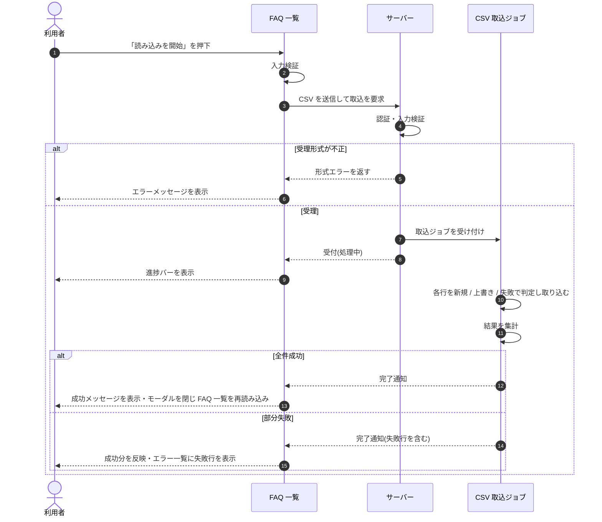

<!-- portal-top -->
[設計ポータル](../../README.md) ／ [基本設計](../index.md) ／ [シーケンス設計](index.md) ／ **SEQ-037: 「読み込みを開始」を押下**
<!-- /portal-top -->

# SEQ-037: 「読み込みを開始」を押下

> **このページは、業務ユースケース UC-028（「読み込みを開始」を押下）のシーケンス図を定義します。**

*版数 v2.0 ・ 更新 2026-06-23 ・ ステータス ドラフト*

## 項目

| 項目 | 内容 |
|---|---|
| SEQ ID | `SEQ-037` |
| 対応業務ユースケース | [UC-028](../../01_requirements/04_business_usecases/UC-028.md#UC-028) |
| 業務要件 (BR) | 要確認 |
| 機能要件 (FR) | [FR-169](../../01_requirements/02_FunctionalRequirement/04_widget-fr.md#FR-169) |
| 画面イベント (EVT) | [EVT-093](../01_frontend/02_screen_events/EVT-093.md#EVT-093) |
| 関連画面 | [SCR-008](../01_frontend/01_screens/SCR-008.md#SCR-008) ・ [SCR-010](../01_frontend/01_screens/SCR-010.md#SCR-010) |
| 関連 API | [API-028](../02_backend/03_apis/API-028.md#API-028) |
| 関連テーブル | — |
| エラー (ERR) | [ERR-026](../05_errors/ERR-026.md#ERR-026) ・ [ERR-027](../05_errors/ERR-027.md#ERR-027) |
| メッセージ (MSG) | 要確認 |

## 概要

CSV による FAQ の一括取込を非同期で受け付け、ジョブの進捗を逐次表示する。全件成功時はモーダルを閉じて FAQ 一覧を再読み込みし、部分失敗時は成功分を反映してエラー一覧に失敗行を表示する。

## シーケンス図

## 例外フロー

- 受理形式が不正(CSV 以外 / 文字コード不正 / 上限超過)の場合は取込を受け付けず、形式エラーを表示する。
- 行内の `FAQ ID` が当該契約に存在しない場合は当該行を失敗とし、エラー一覧に失敗行を表示する。

## 詳細設計への移管候補

| 内容 | 移管先候補 | 理由 |
|---|---|---|
| 取込ジョブの行単位ループ・進捗ポーリング間隔 | 詳細設計(SEQ) | 基本設計では行単位の反復・ポーリング周期を抽象化し、サーバー / ジョブの自己メッセージで表すため |

## 備考

- 本図は基本設計レベルの抽象度(ユーザー / 画面 / サーバー、システム起点は外部システム・スケジューラ・バッチを加える)で記述する。DB 操作はサーバー自己メッセージで表し、テーブル別 CRUD は本図に書かず 関連テーブル 欄で示す。
- 図の出典は業務ユースケース [UC-028](../../01_requirements/04_business_usecases/UC-028.md#UC-028)。画面イベントとの対応は UC-028 を参照。

---

<!-- portal-bottom -->
[← シーケンス設計](index.md) ・ [基本設計](../index.md) ・ [↑ 設計ポータル](../../README.md)
<!-- /portal-bottom -->
