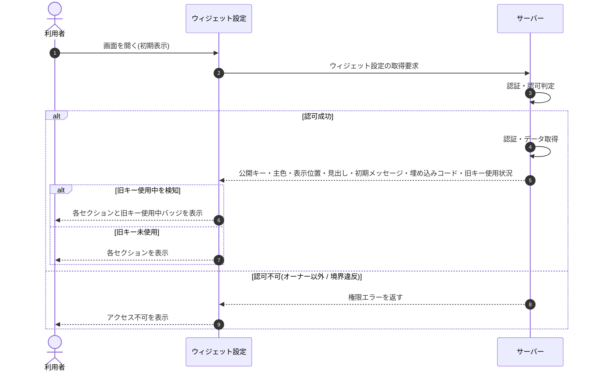

# SEQ-038: 初期表示

> **このページは、業務ユースケース UC-040（初期表示）のシーケンス図を定義します。**

*版数 v2.0 ・ 更新 2026-06-23 ・ ステータス ドラフト*

## 項目

| 項目 | 内容 |
|---|---|
| SEQ ID | `SEQ-038` |
| 対応業務ユースケース | [UC-040](../../01_requirements/04_business_usecases/UC-040.md#UC-040) |
| 業務要件 (BR) | [BR-091](../../01_requirements/01_business_requirement/04_widget-br.md#BR-091) ・ [BR-087](../../01_requirements/01_business_requirement/04_widget-br.md#BR-087) |
| 機能要件 (FR) | [FR-040](../../01_requirements/02_functional_requirement/01_account-fr.md#FR-040) |
| 画面イベント (EVT) | [EVT-096](../01_frontend/02_screen_events/EVT-096.md#EVT-096) |
| 関連画面 | [SCR-011](../01_frontend/01_screens/SCR-011.md#SCR-011) |
| 関連 API | [API-018](../02_backend/03_apis/API-018.md#API-018) |
| 関連テーブル | [TBL-004](../02_backend/04_database/TBL-004.md#TBL-004) ・ [TBL-015](../02_backend/04_database/TBL-015.md#TBL-015) |
| エラー (ERR) | [ERR-017](../05_errors/ERR-017.md#ERR-017) ・ [ERR-019](../05_errors/ERR-019.md#ERR-019) |
| メッセージ (MSG) | — |

## 概要

ウィジェット設定画面を開いたとき、当該プロジェクトの公開キー・主色・表示位置・見出し・初期メッセージ・埋め込みコードを取得して各セクションに表示する。ローテーション猶予中に旧キーの使用を検知している場合は旧キー使用中バッジを併せて表示する。

## シーケンス図

## 例外フロー

- 対象プロジェクトを参照する権限がない（オーナー境界違反の偽装）場合は、存在しない扱いとしてアクセス不可を表示する（[ERR-019](../05_errors/ERR-019.md#ERR-019)）。
- オーナー以外の操作が認可されない場合は、権限エラーを表示する（[ERR-017](../05_errors/ERR-017.md#ERR-017)）。

## 備考

- 本図は基本設計レベルの抽象度(ユーザー / 画面 / サーバー、システム起点は外部システム・スケジューラ・バッチを加える)で記述する。DB 操作はサーバー自己メッセージで表し、テーブル別 CRUD は本図に書かず 関連テーブル 欄で示す。
- 図の出典は業務ユースケース [UC-040](../../01_requirements/04_business_usecases/UC-040.md#UC-040)。画面イベントとの対応は UC-040 を参照。
