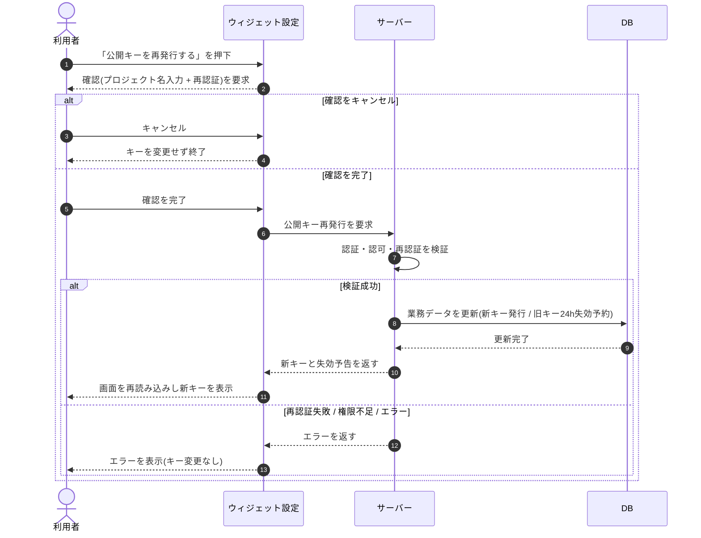

# SEQ-039: 「公開キーを再発行する」を押下

> **このページは、業務ユースケース UC-040（「公開キーを再発行する」を押下）のシーケンス図を定義します。**

## 項目

| 項目 | 内容 |
|---|---|
| SEQ ID | `SEQ-039` |
| トレーサビリティID | [TR-040](../00_traceability/index.md#TR-040) |
| 画面イベント (EVT) | EVT-104 |
| 関連画面 | [SCR-011](../01_frontend/01_screens/SCR-011.md#SCR-011) |
| 関連 API | [API-019](../02_backend/03_apis/API-019.md#API-019) |
| 関連テーブル | [TBL-004](../02_backend/04_database/TBL-004.md#TBL-004) ・ [TBL-015](../02_backend/04_database/TBL-015.md#TBL-015) |
| エラー (ERR) | — |
| メッセージ (MSG) | — |

## 概要

オーナーがウィジェット設定画面で公開キーの再発行を要求し、強い本人確認の完了後に新しい公開キーを発行する。旧キーは 24 時間猶予で失効予告し、画面を再読み込みして新キーを表示する。確認キャンセル時・エラー時はキーを変更しない。

## シーケンス図

## 例外フロー

- 再認証に失敗した場合は公開キーを発行せず、画面はエラーを表示してキーを変更しない。
- オーナー以外（権限不足）の要求は拒否し、キーを変更しない。
- 発行処理がエラーで完了しなかった場合はキーを変更せず、画面はエラーを表示する。

## 備考

- 本図は基本設計レベルの抽象度(ユーザー / 画面 / サーバー、システム起点は外部システム・スケジューラ・バッチを加える)で記述する。DB 操作は DB アクターへのメッセージで表し、テーブル別 CRUD は本図に書かず 関連テーブル 欄で示す。
- 図の出典は業務ユースケース [UC-040](../../01_requirements/04_business_usecases/UC-040.md#UC-040)。画面イベントとの対応は UC-040 を参照。
