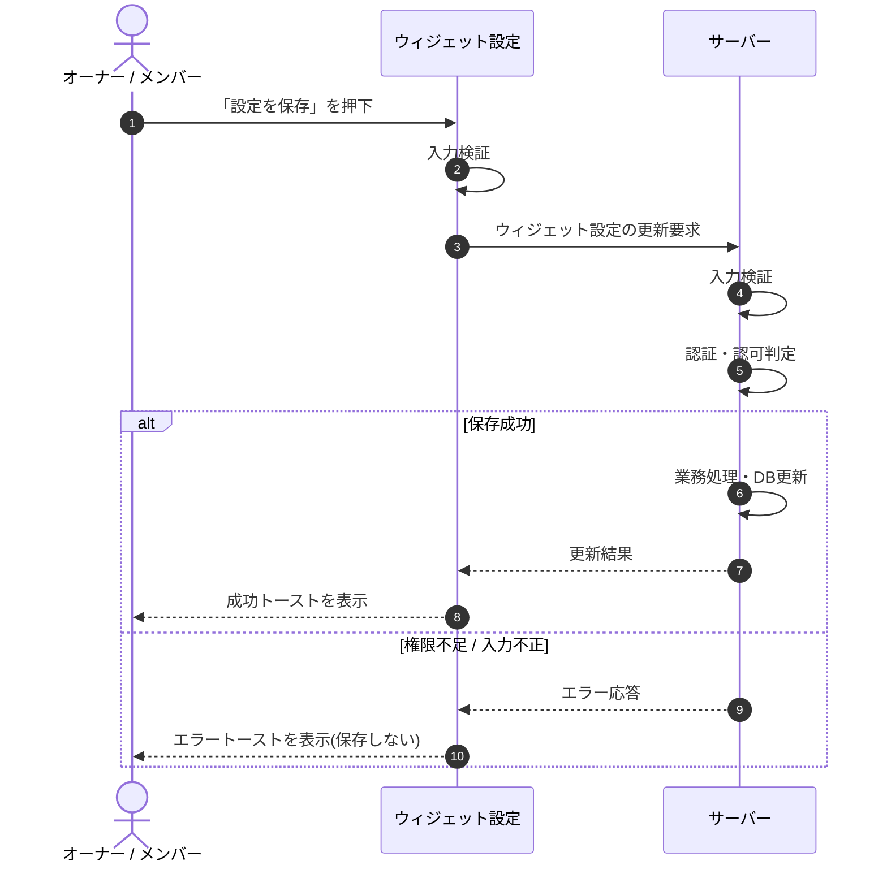

# SEQ-040: 「設定を保存」を押下

> **このページは、業務ユースケース UC-040（「設定を保存」を押下）のシーケンス図を定義します。**

*版数 v2.0 ・ 更新 2026-06-23 ・ ステータス ドラフト*

## 項目

| 項目 | 内容 |
|---|---|
| SEQ ID | `SEQ-040` |
| 対応業務ユースケース | [UC-040](../../01_requirements/04_business_usecases/UC-040.md#UC-040) |
| 業務要件 (BR) | [BR-091](../../01_requirements/01_business_requirement/04_widget-br.md#BR-091) ・ [BR-087](../../01_requirements/01_business_requirement/04_widget-br.md#BR-087) |
| 機能要件 (FR) | [FR-040](../../01_requirements/02_functional_requirement/01_account-fr.md#FR-040) |
| 画面イベント (EVT) | [EVT-105](../01_frontend/02_screen_events/EVT-105.md#EVT-105) |
| 関連画面 | [SCR-011](../01_frontend/01_screens/SCR-011.md#SCR-011) |
| 関連 API | [API-018](../02_backend/03_apis/API-018.md#API-018) |
| 関連テーブル | [TBL-004](../02_backend/04_database/TBL-004.md#TBL-004) |
| エラー (ERR) | [ERR-017](../05_errors/ERR-017.md#ERR-017) ・ [ERR-019](../05_errors/ERR-019.md#ERR-019) |
| メッセージ (MSG) | — |

## 概要

ウィジェット設定画面で見た目等を編集した利用者が「設定を保存」を押下し、ウィジェット設定を更新する。成功時は設定を保存して成功トーストを表示し、失敗時は保存せずエラートーストを表示する。

## シーケンス図

## 例外フロー

- 入力検証エラー: 入力不正の場合は保存せず、エラートーストを表示する。
- 権限不足: オーナー以外による更新は拒否し([ERR-017](../05_errors/ERR-017.md#ERR-017))、保存しない。
- 対象不正: 対象プロジェクトが存在しない / 境界違反の場合は拒否する([ERR-019](../05_errors/ERR-019.md#ERR-019))。

## 備考

- 本図は基本設計レベルの抽象度(ユーザー / 画面 / サーバー、システム起点は外部システム・スケジューラ・バッチを加える)で記述する。DB 操作はサーバー自己メッセージで表し、テーブル別 CRUD は本図に書かず 関連テーブル 欄で示す。
- 図の出典は業務ユースケース [UC-040](../../01_requirements/04_business_usecases/UC-040.md#UC-040)。画面イベントとの対応は UC-040 を参照。
