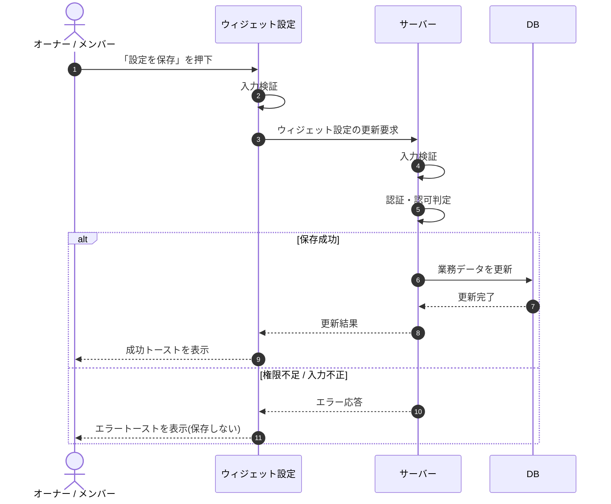

# SEQ-040: 「設定を保存」を押下

> **このページは、業務ユースケース UC-038（「設定を保存」を押下）のシーケンス図を定義します。**

| ID | 業務ユースケースID | イベント(画面ID EVT-NN) | テーブルID |
|----|----|----|----|
| SEQ-040 | [UC-038](../../01_requirements/04_business_usecases/UC-038.md#UC-038) | SCR-011 EVT-10 | [TBL-003](../02_backend/04_database/TBL-003.md#TBL-003) ・ [TBL-004](../02_backend/04_database/TBL-004.md#TBL-004) ・ [TBL-005](../02_backend/04_database/TBL-005.md#TBL-005) ・ [TBL-006](../02_backend/04_database/TBL-006.md#TBL-006) ・ [TBL-013](../02_backend/04_database/TBL-013.md#TBL-013) ・ [TBL-014](../02_backend/04_database/TBL-014.md#TBL-014) ・ [TBL-015](../02_backend/04_database/TBL-015.md#TBL-015) ・ [TBL-017](../02_backend/04_database/TBL-017.md#TBL-017) ・ [TBL-025](../02_backend/04_database/TBL-025.md#TBL-025) ・ [TBL-027](../02_backend/04_database/TBL-027.md#TBL-027) |

## 概要

ウィジェット設定画面で見た目等を編集した利用者が「設定を保存」を押下し、ウィジェット設定を更新する。成功時は設定を保存して成功トーストを表示し、失敗時は保存せずエラートーストを表示する。

## シーケンス図

## 例外フロー

- 入力検証エラー: 入力不正の場合は保存せず、エラートーストを表示する。
- 権限不足: オーナー以外による更新は拒否し([ERR-015](../05_errors/ERR-015.md#ERR-015))、保存しない。
- 対象不正: 対象プロジェクトが存在しない / 境界違反の場合は拒否する([ERR-017](../05_errors/ERR-017.md#ERR-017))。

## 備考

- 本図は基本設計レベルの抽象度(ユーザー / 画面 / サーバー、システム起点は外部システム・スケジューラ・バッチを加える)で記述する。DB 操作は DB アクターへのメッセージで表し、テーブル別 CRUD は本図に書かず 関連テーブル 欄で示す。
- 図の出典は業務ユースケース [UC-038](../../01_requirements/04_business_usecases/UC-038.md#UC-038)。画面イベントとの対応は UC-038 を参照。
