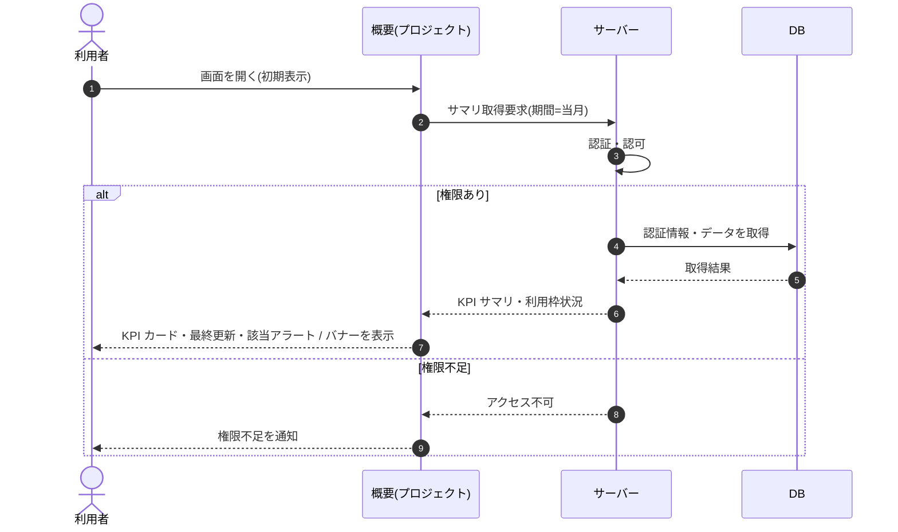

# SEQ-041: 初期表示

> **このページは、業務ユースケース UC-032（初期表示）のシーケンス図を定義します。**

| ID | 業務ユースケースID | イベント(画面ID EVT-NN) | テーブルID |
|----|----|----|----|
| SEQ-041 | [UC-032](../../01_requirements/04_business_usecases/UC-032.md#UC-032) | SCR-012 EVT-01 | [TBL-004](../02_backend/04_database/TBL-004.md#TBL-004) ・ [TBL-005](../02_backend/04_database/TBL-005.md#TBL-005) ・ [TBL-006](../02_backend/04_database/TBL-006.md#TBL-006) ・ [TBL-009](../02_backend/04_database/TBL-009.md#TBL-009) ・ [TBL-017](../02_backend/04_database/TBL-017.md#TBL-017) ・ [TBL-020](../02_backend/04_database/TBL-020.md#TBL-020) ・ [TBL-025](../02_backend/04_database/TBL-025.md#TBL-025) ・ [TBL-026](../02_backend/04_database/TBL-026.md#TBL-026) |

## 概要

オーナーまたはメンバーが概要（プロジェクト）画面を開くと、サーバーが期間内の質問数・未解決・要対応状況などを集計して返し、KPI カードと最終更新時刻を表示する。サスペンション（支払い不能）・利用枠超過・質問数上限到達の各条件に応じてアラート・バナーを表示する。

## シーケンス図

## 例外フロー

- メンバーが対象プロジェクトを指定せずに要求した場合は、入力不備としてエラーを返す。
- 当該プロジェクトへのアクセス権がない場合は、権限不足としてアクセスを拒否する。

## 備考

- 本図は基本設計レベルの抽象度(ユーザー / 画面 / サーバー、システム起点は外部システム・スケジューラ・バッチを加える)で記述する。DB 操作は DB アクターへのメッセージで表し、テーブル別 CRUD は本図に書かず 関連テーブル 欄で示す。
- 図の出典は業務ユースケース [UC-032](../../01_requirements/04_business_usecases/UC-032.md#UC-032)。画面イベントとの対応は UC-032 を参照。
