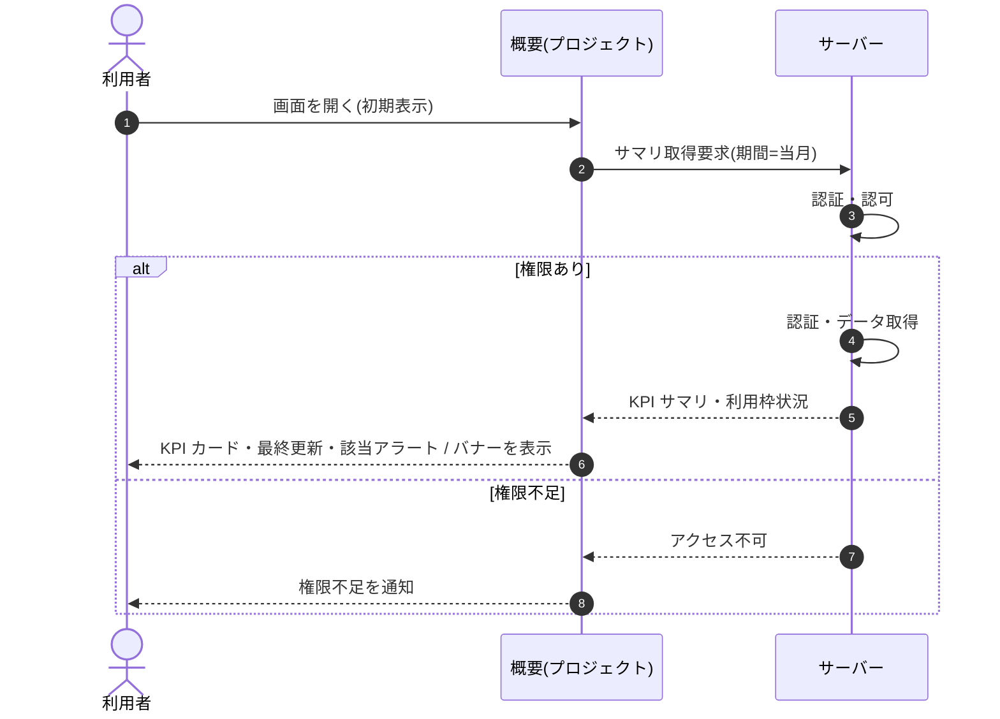

<!-- portal-top -->
[設計ポータル](../../README.md) ／ [基本設計](../index.md) ／ [シーケンス設計](index.md) ／ **SEQ-041: 初期表示**
<!-- /portal-top -->

# SEQ-041: 初期表示

> **このページは、業務ユースケース UC-033（初期表示）のシーケンス図を定義します。**

*版数 v2.0 ・ 更新 2026-06-23 ・ ステータス ドラフト*

## 項目

| 項目 | 内容 |
|---|---|
| SEQ ID | `SEQ-041` |
| 対応業務ユースケース | [UC-033](../../01_requirements/04_business_usecases/UC-033.md#UC-033) |
| 業務要件 (BR) | 要確認 |
| 機能要件 (FR) | [FR-100](../../01_requirements/02_FunctionalRequirement/03_usage-fr.md#FR-100) |
| 画面イベント (EVT) | [EVT-107](../01_frontend/02_screen_events/EVT-107.md#EVT-107) |
| 関連画面 | [SCR-012](../01_frontend/01_screens/SCR-012.md#SCR-012) |
| 関連 API | [API-040](../02_backend/03_apis/API-040.md#API-040) |
| 関連テーブル | [TBL-006](../02_backend/04_database/TBL-006.md#TBL-006) ・ [TBL-020](../02_backend/04_database/TBL-020.md#TBL-020) |
| エラー (ERR) | [ERR-001](../05_errors/ERR-001.md#ERR-001) ・ [ERR-021](../05_errors/ERR-021.md#ERR-021) |
| メッセージ (MSG) | 要確認 |

## 概要

オーナーまたはメンバーが概要（プロジェクト）画面を開くと、サーバーが期間内の質問数・未解決・要対応状況などを集計して返し、KPI カードと最終更新時刻を表示する。契約停止・利用枠超過・質問数上限到達の各条件に応じてアラート・バナーを表示する。

## シーケンス図

## 例外フロー

- メンバーが対象プロジェクトを指定せずに要求した場合は、入力不備としてエラーを返す。
- 当該プロジェクトへのアクセス権がない場合は、権限不足としてアクセスを拒否する。

## 備考

- 本図は基本設計レベルの抽象度(ユーザー / 画面 / サーバー、システム起点は外部システム・スケジューラ・バッチを加える)で記述する。DB 操作はサーバー自己メッセージで表し、テーブル別 CRUD は本図に書かず 関連テーブル 欄で示す。
- 図の出典は業務ユースケース [UC-033](../../01_requirements/04_business_usecases/UC-033.md#UC-033)。画面イベントとの対応は UC-033 を参照。

---

<!-- portal-bottom -->
[← シーケンス設計](index.md) ・ [基本設計](../index.md) ・ [↑ 設計ポータル](../../README.md)
<!-- /portal-bottom -->
