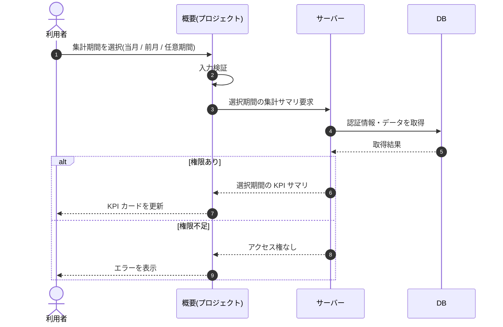

# SEQ-042: 期間を選択

> **このページは、業務ユースケース UC-032（期間を選択）のシーケンス図を定義します。**

| ID | シーケンス名 |
|----|----|
| SEQ-042 | 期間を選択 |

| 関連項目 | 内容 |
|----|----| 
| 業務ユースケース | [UC-032](../../01_requirements/04_business_usecases/UC-032.md#UC-032) |
| イベント | [SCR-012 EVT-02](../01_frontend/01_screens/SCR-012.md#SCR-012) |
| 関連画面 | [SCR-012](../01_frontend/01_screens/SCR-012.md#SCR-012) |
| 関連API | [API-040](../02_backend/03_apis/API-040.md#API-040) |
| テーブル | [TBL-006](../02_backend/04_database/TBL-006.md#TBL-006) / [TBL-020](../02_backend/04_database/TBL-020.md#TBL-020) / [TBL-025](../02_backend/04_database/TBL-025.md#TBL-025) / [TBL-017](../02_backend/04_database/TBL-017.md#TBL-017) |
| エラー(ERR) | [ERR-001](../05_errors/ERR-001.md#ERR-001) / [ERR-019](../05_errors/ERR-019.md#ERR-019) |
| メッセージ(MSG) | — |

## 概要

利用者が概要画面で集計期間（当月 / 前月 / 任意期間）を選択すると、サーバーが選択期間の集計値を取得し、KPI カードを更新する。

## シーケンス図

## 例外フロー

- メンバーが対象プロジェクトを指定せずに要求した場合、入力不備として処理を中断する。
- 当該プロジェクトへのアクセス権がない場合、アクセス権なしとして集計を返さずエラーを表示する。

## 備考

- 本図は基本設計レベルの抽象度(ユーザー / 画面 / サーバー、システム起点は外部システム・スケジューラ・バッチを加える)で記述する。DB 操作は DB アクターへのメッセージで表し、テーブル別 CRUD は本図に書かず 関連テーブル 欄で示す。
- 図の出典は業務ユースケース [UC-032](../../01_requirements/04_business_usecases/UC-032.md#UC-032)。画面イベントとの対応は UC-032 を参照。
