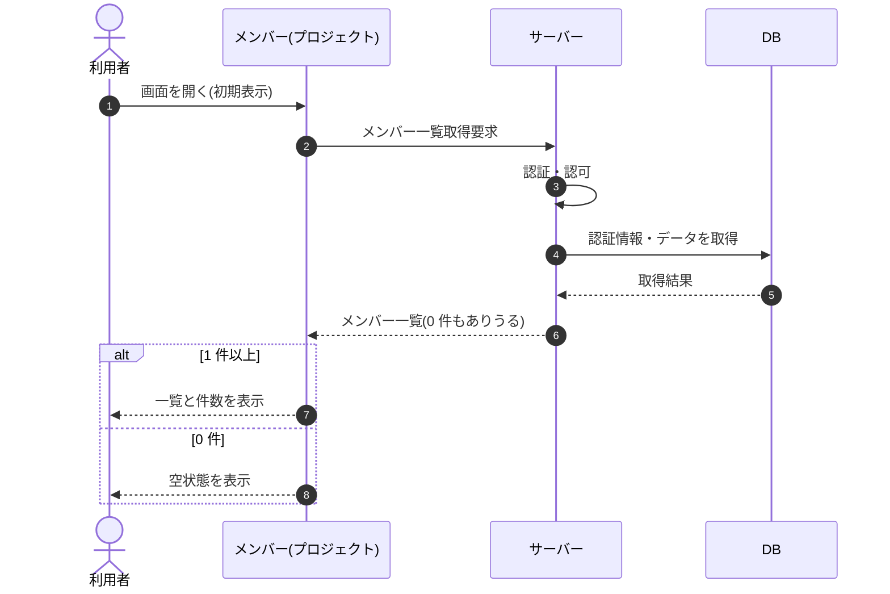

# SEQ-043: 初期表示

> **このページは、業務ユースケース UC-018（初期表示）のシーケンス図を定義します。**

## 項目

| 項目 | 内容 |
|---|---|
| SEQ ID | `SEQ-043` |
| トレーサビリティID | [TR-018](../00_traceability/index.md#TR-018) |
| 画面イベント (EVT) | EVT-099 |
| 関連画面 | [SCR-013](../01_frontend/01_screens/SCR-013.md#SCR-013) |
| 関連 API | [API-020](../02_backend/03_apis/API-020.md#API-020) |
| 関連テーブル | [TBL-003](../02_backend/04_database/TBL-003.md#TBL-003), [TBL-001](../02_backend/04_database/TBL-001.md#TBL-001) |
| エラー (ERR) | — |
| メッセージ (MSG) | — |

## 概要

メンバー画面を開いたとき、当該プロジェクトのメンバー一覧と件数を表示する。割当が 0 件のときは空状態を表示する。

## シーケンス図

## 備考

- 本図は基本設計レベルの抽象度(ユーザー / 画面 / サーバー、システム起点は外部システム・スケジューラ・バッチを加える)で記述する。DB 操作は DB アクターへのメッセージで表し、テーブル別 CRUD は本図に書かず 関連テーブル 欄で示す。
- 図の出典は業務ユースケース [UC-018](../../01_requirements/04_business_usecases/UC-018.md#UC-018)。画面イベントとの対応は UC-018 を参照。
