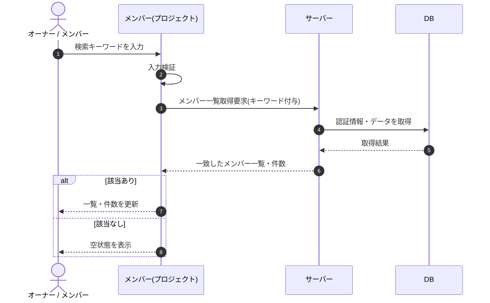

# SEQ-044: 検索を入力

> **このページは、業務ユースケース UC-018（検索を入力）のシーケンス図を定義します。**

| ID | 業務ユースケースID | イベント(画面ID EVT-NN) | テーブルID |
|----|----|----|----|
| SEQ-044 | [UC-018](../../01_requirements/04_business_usecases/UC-018.md#UC-018) | SCR-013 EVT-02 | [TBL-003](../02_backend/04_database/TBL-003.md#TBL-003) |

## 概要

メンバー画面で表示名・メールアドレスのキーワードを入力すると、部分一致するメンバーで一覧と件数表示を更新する。0 件のときは空状態を表示する。

## シーケンス図

## 備考

- 本図は基本設計レベルの抽象度(ユーザー / 画面 / サーバー、システム起点は外部システム・スケジューラ・バッチを加える)で記述する。DB 操作は DB アクターへのメッセージで表し、テーブル別 CRUD は本図に書かず 関連テーブル 欄で示す。
- 図の出典は業務ユースケース [UC-018](../../01_requirements/04_business_usecases/UC-018.md#UC-018)。画面イベントとの対応は UC-018 を参照。
