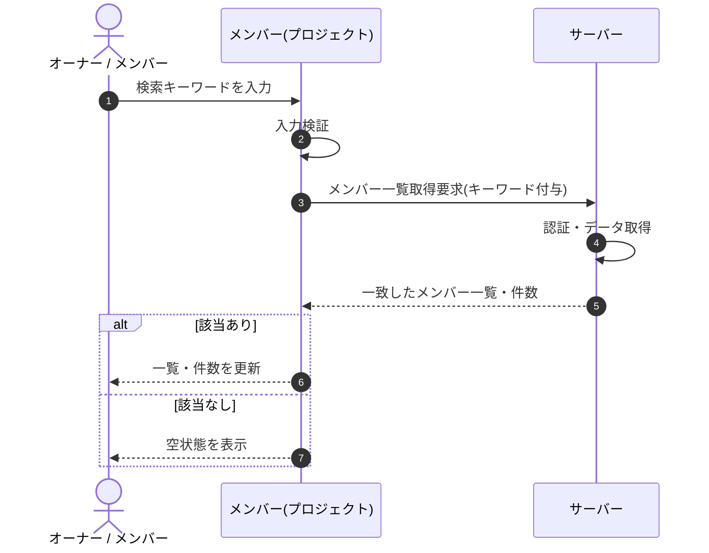

# SEQ-044: 検索を入力

> **このページは、業務ユースケース UC-018（検索を入力）のシーケンス図を定義します。**

## 項目

| 項目 | 内容 |
|---|---|
| SEQ ID | `SEQ-044` |
| 対応業務ユースケース | [UC-018](../../01_requirements/04_business_usecases/UC-018.md#UC-018) |
| 業務要件 (BR) | [BR-010](../../01_requirements/01_business_requirement/01_account-br.md#BR-010) ・ [BR-136](../../01_requirements/01_business_requirement/01_account-br.md#BR-136) |
| 機能要件 (FR) | [FR-027](../../01_requirements/02_functional_requirement/01_account-fr.md#FR-027) ・ [FR-022](../../01_requirements/02_functional_requirement/01_account-fr.md#FR-022) ・ [FR-036](../../01_requirements/02_functional_requirement/01_account-fr.md#FR-036) |
| 画面イベント (EVT) | [EVT-116](../01_frontend/02_screen_events/EVT-116.md#EVT-116) |
| 関連画面 | [SCR-013](../01_frontend/01_screens/SCR-013.md#SCR-013) |
| 関連 API | [API-020](../02_backend/03_apis/API-020.md#API-020) |
| 関連テーブル | [TBL-003](../02_backend/04_database/TBL-003.md#TBL-003) |
| エラー (ERR) | — |
| メッセージ (MSG) | — |

## 概要

メンバー画面で表示名・メールアドレスのキーワードを入力すると、部分一致するメンバーで一覧と件数表示を更新する。0 件のときは空状態を表示する。

## シーケンス図

## 備考

- 本図は基本設計レベルの抽象度(ユーザー / 画面 / サーバー、システム起点は外部システム・スケジューラ・バッチを加える)で記述する。DB 操作はサーバー自己メッセージで表し、テーブル別 CRUD は本図に書かず 関連テーブル 欄で示す。
- 図の出典は業務ユースケース [UC-018](../../01_requirements/04_business_usecases/UC-018.md#UC-018)。画面イベントとの対応は UC-018 を参照。
