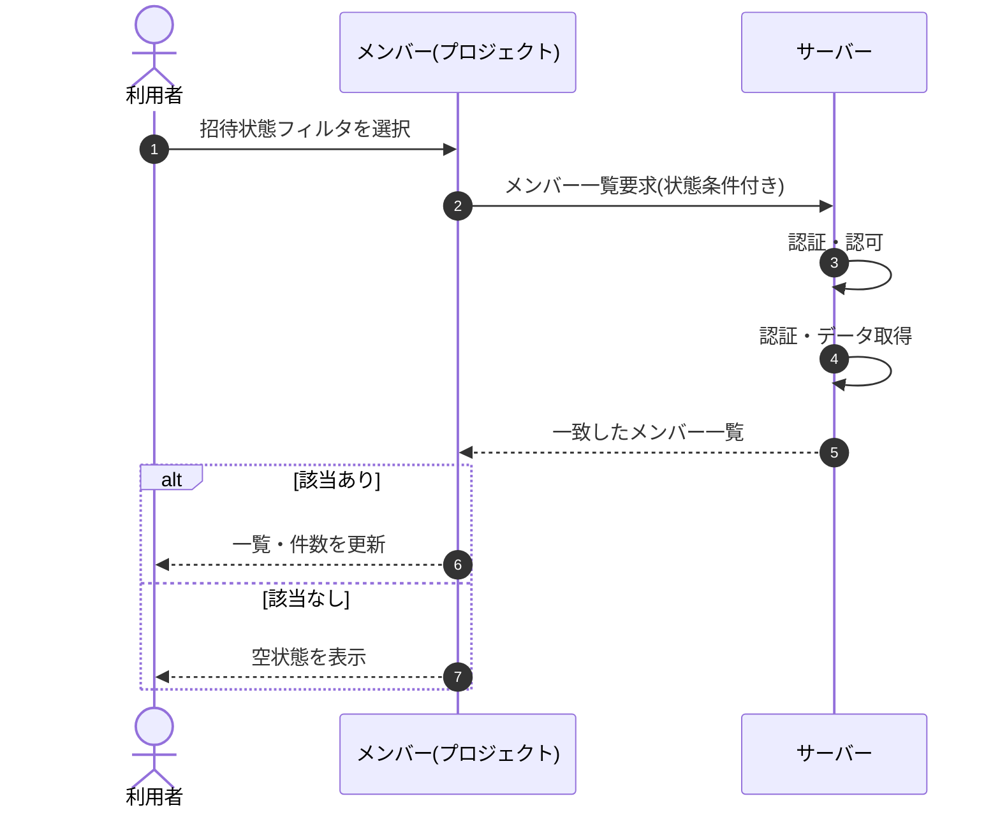

<!-- portal-top -->
[設計ポータル](../../README.md) ／ [基本設計](../index.md) ／ [シーケンス設計](index.md) ／ **SEQ-045: 招待状態フィルタを選択**
<!-- /portal-top -->

# SEQ-045: 招待状態フィルタを選択

> **このページは、業務ユースケース UC-018（招待状態フィルタを選択）のシーケンス図を定義します。**

*版数 v2.0 ・ 更新 2026-06-23 ・ ステータス ドラフト*

## 項目

| 項目 | 内容 |
|---|---|
| SEQ ID | `SEQ-045` |
| 対応業務ユースケース | [UC-018](../../01_requirements/04_business_usecases/UC-018.md#UC-018) |
| 業務要件 (BR) | [BR-010](../../01_requirements/01_BusinessRequirement/01_account-br.md#BR-010) ・ [BR-136](../../01_requirements/01_BusinessRequirement/01_account-br.md#BR-136) |
| 機能要件 (FR) | [FR-027](../../01_requirements/02_FunctionalRequirement/01_account-fr.md#FR-027) ・ [FR-022](../../01_requirements/02_FunctionalRequirement/01_account-fr.md#FR-022) ・ [FR-036](../../01_requirements/02_FunctionalRequirement/01_account-fr.md#FR-036) |
| 画面イベント (EVT) | [EVT-117](../01_frontend/02_screen_events/EVT-117.md#EVT-117) |
| 関連画面 | [SCR-013](../01_frontend/01_screens/SCR-013.md#SCR-013) |
| 関連 API | [API-020](../02_backend/03_apis/API-020.md#API-020) |
| 関連テーブル | [TBL-003](../02_backend/04_database/TBL-003.md#TBL-003) |
| エラー (ERR) | — |
| メッセージ (MSG) | — |

## 概要

メンバー画面で招待状態フィルタ（すべて / 招待中のみ / アクティベーション済み）を選択すると、選択条件に一致するメンバーで一覧と件数表示を更新する。0 件のときは空状態を表示する。

## シーケンス図

## 備考

- 本図は基本設計レベルの抽象度(ユーザー / 画面 / サーバー、システム起点は外部システム・スケジューラ・バッチを加える)で記述する。DB 操作はサーバー自己メッセージで表し、テーブル別 CRUD は本図に書かず 関連テーブル 欄で示す。
- 図の出典は業務ユースケース [UC-018](../../01_requirements/04_business_usecases/UC-018.md#UC-018)。画面イベントとの対応は UC-018 を参照。

---

<!-- portal-bottom -->
[← シーケンス設計](index.md) ・ [基本設計](../index.md) ・ [↑ 設計ポータル](../../README.md)
<!-- /portal-bottom -->
