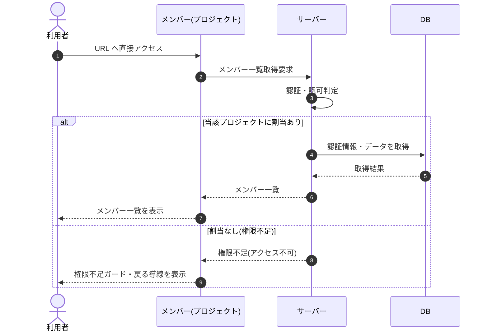

# SEQ-046: 権限なしで URL 直アクセス

> **このページは、業務ユースケース UC-047（権限なしで URL 直アクセス）のシーケンス図を定義します。**

## 項目

| 項目 | 内容 |
|---|---|
| SEQ ID | `SEQ-046` |
| トレーサビリティID | [TR-047](../00_traceability/index.md#TR-047) |
| 画面イベント (EVT) | EVT-103 |
| 関連画面 | [SCR-013](../01_frontend/01_screens/SCR-013.md#SCR-013) |
| 関連 API | [API-020](../02_backend/03_apis/API-020.md#API-020) |
| 関連テーブル | [TBL-003](../02_backend/04_database/TBL-003.md#TBL-003) |
| エラー (ERR) | — |
| メッセージ (MSG) | — |

## 概要

当該プロジェクトへの割当を持たないログイン済みユーザーがメンバー画面の URL へ直接アクセスした際の認可判定フローを定義する。割当が無い場合は権限不足ガードを表示し、ダッシュボードへ戻る導線を提示する。

## シーケンス図

## 例外フロー

- 当該プロジェクトへの割当が無い場合、サーバーはアクセスを拒否し、画面は権限不足ガードと「ダッシュボードへ戻る」導線を表示する。

## 備考

- 本図は基本設計レベルの抽象度(ユーザー / 画面 / サーバー、システム起点は外部システム・スケジューラ・バッチを加える)で記述する。DB 操作は DB アクターへのメッセージで表し、テーブル別 CRUD は本図に書かず 関連テーブル 欄で示す。
- 図の出典は業務ユースケース [UC-047](../../01_requirements/04_business_usecases/UC-047.md#UC-047)。画面イベントとの対応は UC-047 を参照。
