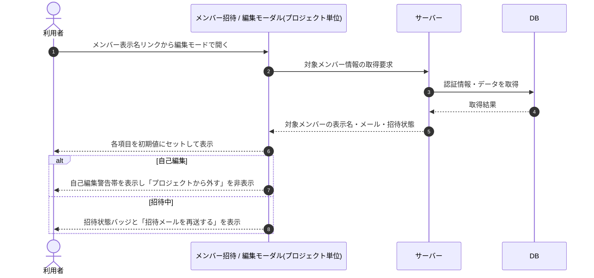

# SEQ-047: 初期表示 — 編集モード

> **このページは、業務ユースケース UC-020（初期表示 — 編集モード）のシーケンス図を定義します。**

## 項目

| 項目 | 内容 |
|---|---|
| SEQ ID | `SEQ-047` |
| トレーサビリティID | [TR-020](../00_traceability/index.md#TR-020) |
| 画面イベント (EVT) | EVT-112 |
| 関連画面 | [SCR-014](../01_frontend/01_screens/SCR-014.md#SCR-014) |
| 関連 API | [API-020](../02_backend/03_apis/API-020.md#API-020) |
| 関連テーブル | [TBL-003](../02_backend/04_database/TBL-003.md#TBL-003) |
| エラー (ERR) | — |
| メッセージ (MSG) | — |

## 概要

メンバー表示名リンクから編集モードでモーダルを開き、対象メンバーの表示名・メールアドレス・招待状態を初期値にセットして表示する。自己編集時は自己編集警告帯を表示して「プロジェクトから外す」を非表示にし、招待中時は招待状態バッジと「招待メールを再送する」を表示する。

## シーケンス図

## 備考

- 本図は基本設計レベルの抽象度(ユーザー / 画面 / サーバー、システム起点は外部システム・スケジューラ・バッチを加える)で記述する。DB 操作は DB アクターへのメッセージで表し、テーブル別 CRUD は本図に書かず 関連テーブル 欄で示す。
- 図の出典は業務ユースケース [UC-020](../../01_requirements/04_business_usecases/UC-020.md#UC-020)。画面イベントとの対応は UC-020 を参照。
