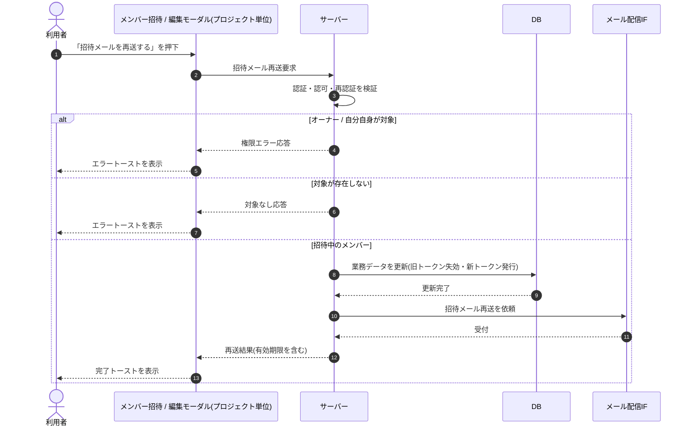

# SEQ-048: 「招待メールを再送する」を押下

> **このページは、業務ユースケース UC-019（「招待メールを再送する」を押下）のシーケンス図を定義します。**

| ID | 業務ユースケースID | イベント(画面ID EVT-NN) | テーブルID |
|----|----|----|----|
| SEQ-048 | [UC-019](../../01_requirements/04_business_usecases/UC-019.md#UC-019) | SCR-014 EVT-04 | [TBL-001](../02_backend/04_database/TBL-001.md#TBL-001) ・ [TBL-003](../02_backend/04_database/TBL-003.md#TBL-003) ・ [TBL-014](../02_backend/04_database/TBL-014.md#TBL-014) ・ [TBL-026](../02_backend/04_database/TBL-026.md#TBL-026) |

## 概要

オーナーまたは当該プロジェクトのメンバーが招待中の対象者に対して招待メールを再送する。成功時は旧リンクを失効させ新トークン（7 日）を発行して再送し完了トーストを表示し、失敗時はエラートーストを表示する。

## シーケンス図

## 例外フロー

- オーナーまたは自分自身を対象に指定した場合、権限エラー（[ERR-021](../05_errors/ERR-021.md#ERR-021) / [ERR-022](../05_errors/ERR-022.md#ERR-022)）を返しエラートーストを表示する。
- 対象メンバーが存在しない場合、対象なしエラー（[ERR-017](../05_errors/ERR-017.md#ERR-017)）を返しエラートーストを表示する。

## 備考

- 本図は基本設計レベルの抽象度（ユーザー / 画面 / サーバー、システム起点は外部システム・スケジューラ・バッチを加える）で記述する。DB 操作は DB アクターへのメッセージで表し、テーブル別 CRUD は本図に書かず 関連テーブル 欄で示す。
- 図の出典は業務ユースケース [UC-019](../../01_requirements/04_business_usecases/UC-019.md#UC-019)。画面イベントとの対応は UC-019 を参照。
