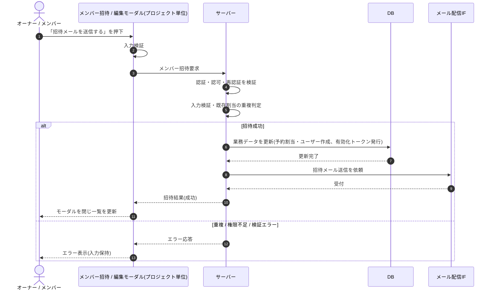

# SEQ-048: 「招待メールを送信する」を押下

> **このページは、業務ユースケース UC-019（「招待メールを送信する」を押下）のシーケンス図を定義します。**

## 項目

| 項目 | 内容 |
|---|---|
| SEQ ID | `SEQ-048` |
| トレーサビリティID | [TR-019](../00_traceability/index.md#TR-019) |
| 画面イベント (EVT) | EVT-107 |
| 関連画面 | [SCR-014](../01_frontend/01_screens/SCR-014.md#SCR-014) |
| 関連 API | [API-021](../02_backend/03_apis/API-021.md#API-021) |
| 関連テーブル | [TBL-003](../02_backend/04_database/TBL-003.md#TBL-003) ・ [TBL-014](../02_backend/04_database/TBL-014.md#TBL-014) |
| エラー (ERR) | [ERR-001](../05_errors/ERR-001.md#ERR-001) ・ [ERR-020](../05_errors/ERR-020.md#ERR-020) ・ [ERR-021](../05_errors/ERR-021.md#ERR-021) |
| メッセージ (MSG) | [MSG-003](../06_messages/MSG-003.md#MSG-003) |

## 概要

招待モーダルで「招待メールを送信する」を押下し、サーバーが予約割当行とユーザーを作成して有効化トークン（7 日）を発行し招待メールを送信する。成功時はモーダルを閉じて一覧を更新し、失敗時はモーダルを保持してエラーを表示する。

## シーケンス図

## 例外フロー

- 入力値の形式が不正な場合は検証エラーとし、モーダルを保持して入力欄にエラーを表示する。
- 招待先が既に当該プロジェクトに割り当て済みの場合は重複エラーとし、招待を中止する。
- 当該プロジェクトへの権限がない場合は権限不足エラーとして中止する。

## 備考

- 本図は基本設計レベルの抽象度(ユーザー / 画面 / サーバー、システム起点は外部システム・スケジューラ・バッチを加える)で記述する。DB 操作は DB アクターへのメッセージで表し、テーブル別 CRUD は本図に書かず 関連テーブル 欄で示す。
- 図の出典は業務ユースケース [UC-019](../../01_requirements/04_business_usecases/UC-019.md#UC-019)。画面イベントとの対応は UC-019 を参照。
