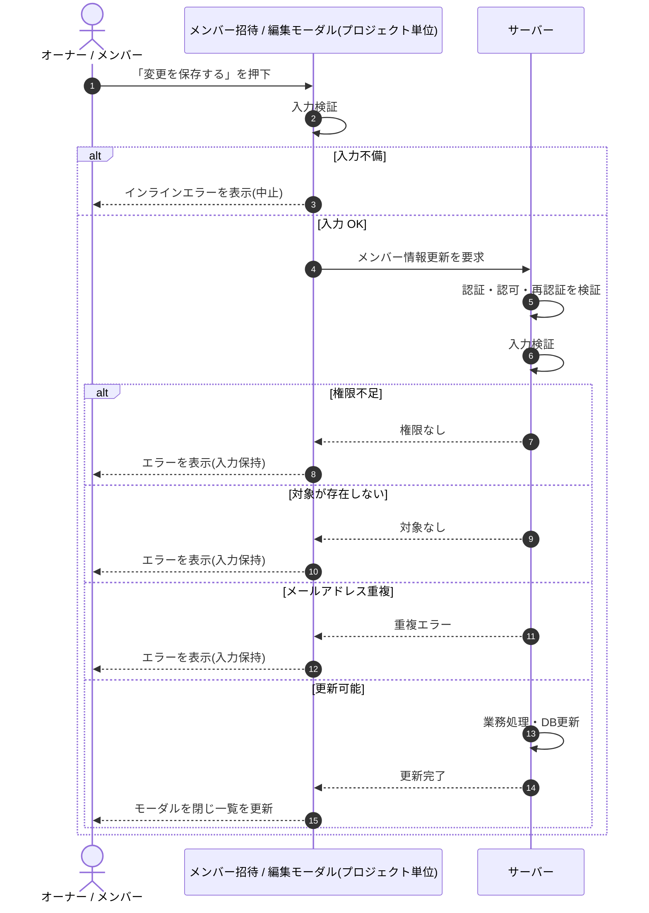

# SEQ-050: 「変更を保存する」を押下

> **このページは、業務ユースケース UC-020（「変更を保存する」を押下）のシーケンス図を定義します。**

*版数 v2.0 ・ 更新 2026-06-23 ・ ステータス ドラフト*

## 項目

| 項目 | 内容 |
|---|---|
| SEQ ID | `SEQ-050` |
| 対応業務ユースケース | [UC-020](../../01_requirements/04_business_usecases/UC-020.md#UC-020) |
| 業務要件 (BR) | [BR-013](../../01_requirements/01_business_requirement/01_account-br.md#BR-013) |
| 機能要件 (FR) | [FR-027](../../01_requirements/02_functional_requirement/01_account-fr.md#FR-027) ・ [FR-024](../../01_requirements/02_functional_requirement/01_account-fr.md#FR-024) |
| 画面イベント (EVT) | [EVT-128](../01_frontend/02_screen_events/EVT-128.md#EVT-128) |
| 関連画面 | [SCR-014](../01_frontend/01_screens/SCR-014.md#SCR-014) |
| 関連 API | [API-022](../02_backend/03_apis/API-022.md#API-022) |
| 関連テーブル | [TBL-003](../02_backend/04_database/TBL-003.md#TBL-003) |
| エラー (ERR) | [ERR-001](../05_errors/ERR-001.md#ERR-001) ・ [ERR-019](../05_errors/ERR-019.md#ERR-019) ・ [ERR-021](../05_errors/ERR-021.md#ERR-021) ・ [ERR-022](../05_errors/ERR-022.md#ERR-022) |
| メッセージ (MSG) | — |

## 概要

メンバー招待 / 編集モーダルで「変更を保存する」を押下すると、対象メンバーのメールアドレスを更新する。成功時は変更を監査記録して当該メンバーへ通知し、モーダルを閉じて一覧を更新する。失敗時はモーダルを保持してエラーを表示する。

## シーケンス図

## 例外フロー

- 入力値が不正な場合は更新を中止し、入力を保持したままエラーを表示する。
- 当該プロジェクトへの権限がない場合は更新を拒否しエラーを表示する。
- 対象メンバーが存在しない場合は更新を中止しエラーを表示する。
- 更新後メールアドレスが既存と重複する場合は更新を拒否し重複エラーを表示する。

## 備考

- 本図は基本設計レベルの抽象度(ユーザー / 画面 / サーバー、システム起点は外部システム・スケジューラ・バッチを加える)で記述する。DB 操作はサーバー自己メッセージで表し、テーブル別 CRUD は本図に書かず 関連テーブル 欄で示す。
- 図の出典は業務ユースケース [UC-020](../../01_requirements/04_business_usecases/UC-020.md#UC-020)。画面イベントとの対応は UC-020 を参照。
