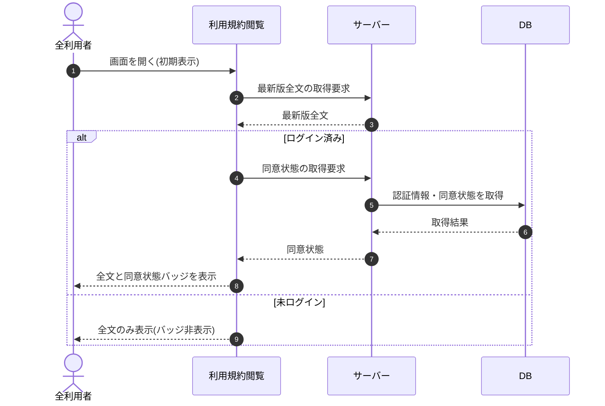

# SEQ-051: 初期表示

> **このページは、業務ユースケース UC-011（初期表示）のシーケンス図を定義します。**

| ID | シーケンス名 |
|----|----|
| SEQ-051 | 初期表示 |

| 関連項目 | 内容 |
|----|----| 
| 業務ユースケース | [UC-011](../../01_requirements/04_business_usecases/UC-011.md#UC-011) |
| イベント | [SCR-015 EVT-01](../01_frontend/01_screens/SCR-015.md#SCR-015) |
| 関連画面 | [SCR-015](../01_frontend/01_screens/SCR-015.md#SCR-015) |
| 関連API | [API-052](../02_backend/03_apis/API-052.md#API-052) |
| テーブル | [TBL-012](../02_backend/04_database/TBL-012.md#TBL-012) / [TBL-024](../02_backend/04_database/TBL-024.md#TBL-024) |
| エラー(ERR) | — |
| メッセージ(MSG) | — |

## 概要

利用規約閲覧画面を開いたとき、最新版の利用規約全文を取得して表示する。全文は公開取得([API-052](../02_backend/03_apis/API-052.md#API-052))で誰でも取得でき、テーブルへはアクセスしない。アカウント利用者がログイン済みのときは、これとは別に同意状態を取得して同意状態バッジを併せて表示し、未ログインのときは同意状態を取得せずバッジを非表示にする。

## シーケンス図

## 備考

- 本図は基本設計レベルの抽象度(ユーザー / 画面 / サーバー、システム起点は外部システム・スケジューラ・バッチを加える)で記述する。DB 操作は DB アクターへのメッセージで表し、テーブル別 CRUD は本図に書かず 関連テーブル 欄で示す。
- 図の出典は業務ユースケース [UC-011](../../01_requirements/04_business_usecases/UC-011.md#UC-011)。画面イベントとの対応は UC-011 を参照。
- 最新版全文の取得は公開取得 [API-052](../02_backend/03_apis/API-052.md#API-052) が担い、テーブルへはアクセスしない。ログイン済み分岐の同意状態取得は、これとは別系統の読み取りとして [TBL-024](../02_backend/04_database/TBL-024.md#TBL-024)(T_TERMS_AGREE)を参照する。同意状態取得を担う専用 API は未設のため、API 採番・新設後に 関連 API 欄へ追記して結線する。
