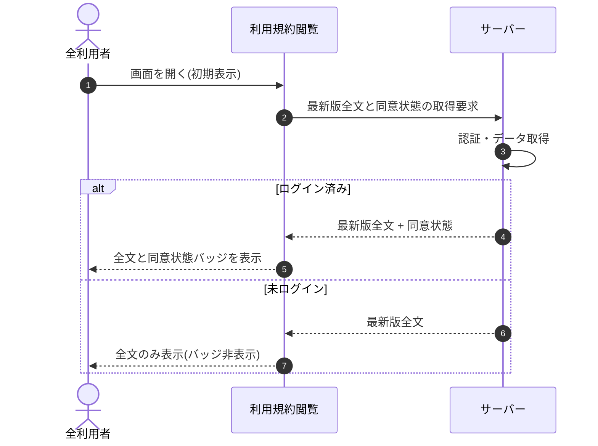

# SEQ-052: 初期表示

> **このページは、業務ユースケース UC-011（初期表示）のシーケンス図を定義します。**

*版数 v2.0 ・ 更新 2026-06-23 ・ ステータス ドラフト*

## 項目

| 項目 | 内容 |
|---|---|
| SEQ ID | `SEQ-052` |
| 対応業務ユースケース | [UC-011](../../01_requirements/04_business_usecases/UC-011.md#UC-011) |
| 業務要件 (BR) | [BR-097](../../01_requirements/01_business_requirement/06_security-br.md#BR-097) |
| 機能要件 (FR) | [FR-139](../../01_requirements/02_functional_requirement/06_security-fr.md#FR-139) |
| 画面イベント (EVT) | [EVT-133](../01_frontend/02_screen_events/EVT-133.md#EVT-133) |
| 関連画面 | [SCR-015](../01_frontend/01_screens/SCR-015.md#SCR-015) |
| 関連 API | [API-052](../02_backend/03_apis/API-052.md#API-052) |
| 関連テーブル | [TBL-012](../02_backend/04_database/TBL-012.md#TBL-012) ・ [TBL-024](../02_backend/04_database/TBL-024.md#TBL-024) |
| エラー (ERR) | — |
| メッセージ (MSG) | — |

## 概要

利用規約閲覧画面を開いたとき、最新版の利用規約全文を取得して表示する。アカウント利用者がログイン済みのときは同意状態バッジを併せて表示し、未ログインのときはバッジを非表示にする。

## シーケンス図

## 備考

- 本図は基本設計レベルの抽象度(ユーザー / 画面 / サーバー、システム起点は外部システム・スケジューラ・バッチを加える)で記述する。DB 操作はサーバー自己メッセージで表し、テーブル別 CRUD は本図に書かず 関連テーブル 欄で示す。
- 図の出典は業務ユースケース [UC-011](../../01_requirements/04_business_usecases/UC-011.md#UC-011)。画面イベントとの対応は UC-011 を参照。
