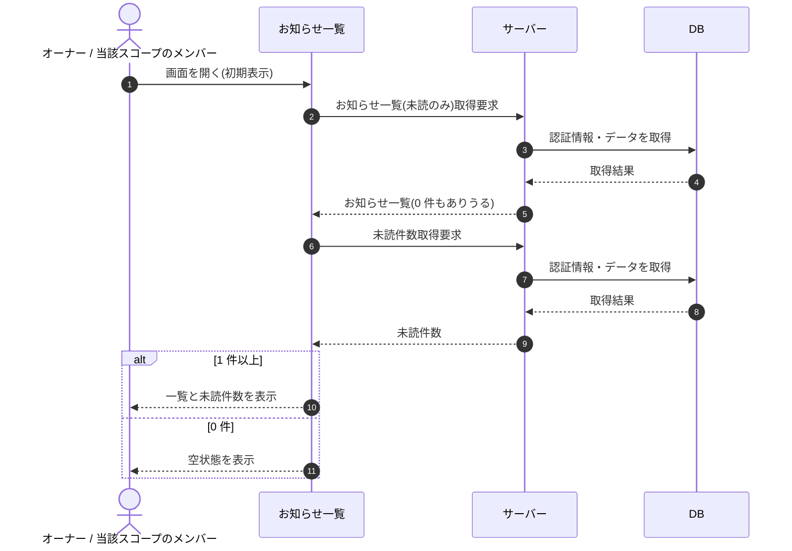

# SEQ-053: 初期表示

> **このページは、業務ユースケース UC-043（初期表示）のシーケンス図を定義します。**

| ID | 業務ユースケースID | イベント(画面ID EVT-NN) | テーブルID |
|----|----|----|----|
| SEQ-053 | [UC-043](../../01_requirements/04_business_usecases/UC-043.md#UC-043) | SCR-016 EVT-01 | [TBL-010](../02_backend/04_database/TBL-010.md#TBL-010) ・ [TBL-021](../02_backend/04_database/TBL-021.md#TBL-021) ・ [TBL-022](../02_backend/04_database/TBL-022.md#TBL-022) |

## 概要

お知らせ一覧画面を開いたとき、未読のみを既定条件にお知らせ一覧と未読件数を取得して表示する。1 件以上あれば一覧と件数を表示し、0 件のときは空状態を表示する。

## シーケンス図

## 備考

- 本図は基本設計レベルの抽象度(ユーザー / 画面 / サーバー、システム起点は外部システム・スケジューラ・バッチを加える)で記述する。DB 操作は DB アクターへのメッセージで表し、テーブル別 CRUD は本図に書かず 関連テーブル 欄で示す。
- 図の出典は業務ユースケース [UC-043](../../01_requirements/04_business_usecases/UC-043.md#UC-043)。画面イベントとの対応は UC-043 を参照。
