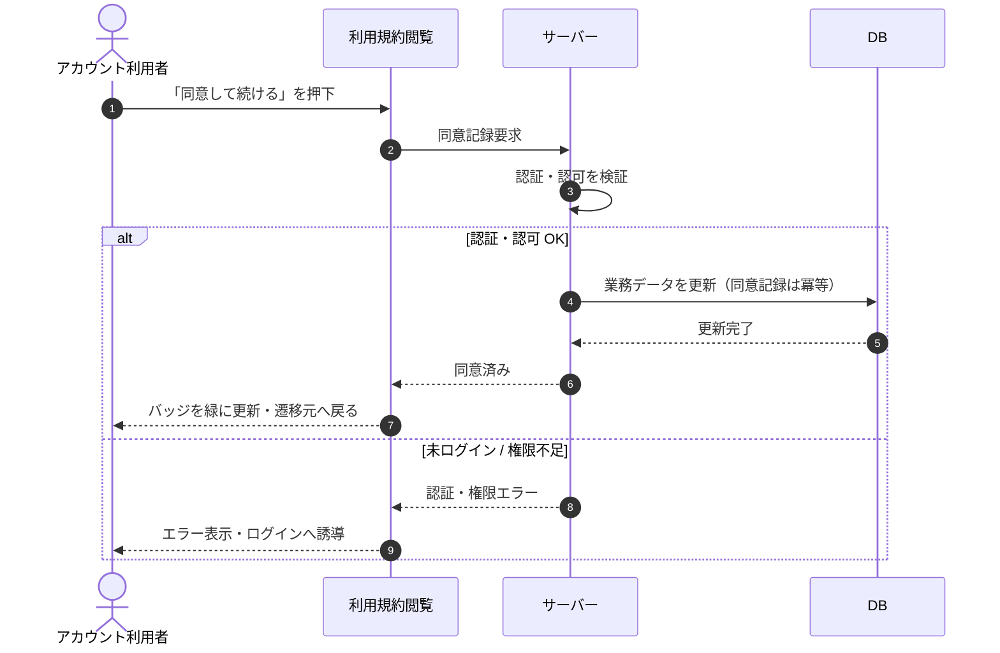

# SEQ-053: 「同意して続ける」を押下

> **このページは、業務ユースケース UC-013（「同意して続ける」を押下）のシーケンス図を定義します。**

## 項目

| 項目 | 内容 |
|---|---|
| SEQ ID | `SEQ-053` |
| トレーサビリティID | [TR-013](../00_traceability/index.md#TR-013) |
| 画面イベント (EVT) | EVT-135 |
| 関連画面 | [SCR-015](../01_frontend/01_screens/SCR-015.md#SCR-015) |
| 関連 API | [API-054](../02_backend/03_apis/API-054.md#API-054) |
| 関連テーブル | [TBL-024](../02_backend/04_database/TBL-024.md#TBL-024) |
| エラー (ERR) | — |
| メッセージ (MSG) | — |

## 概要

ログイン済みのアカウント利用者が利用規約最新版を確認し「同意して続ける」を押下すると、最新版への同意を冪等に記録する。記録後、同意状態バッジを緑に更新し遷移元画面（またはトップ）へ戻す。

## シーケンス図

## 例外フロー

- 未ログインまたはセッション無効のときは、サーバーが認証エラーを返し、画面はログインへ誘導する。
- オーナー / メンバー以外で権限が無いときは、サーバーが権限エラーを返し、画面はエラーを表示する。

## 備考

- 本図は基本設計レベルの抽象度(ユーザー / 画面 / サーバー、システム起点は外部システム・スケジューラ・バッチを加える)で記述する。DB 操作は DB アクターへのメッセージで表し、テーブル別 CRUD は本図に書かず 関連テーブル 欄で示す。
- 図の出典は業務ユースケース [UC-013](../../01_requirements/04_business_usecases/UC-013.md#UC-013)。画面イベントとの対応は UC-013 を参照。
