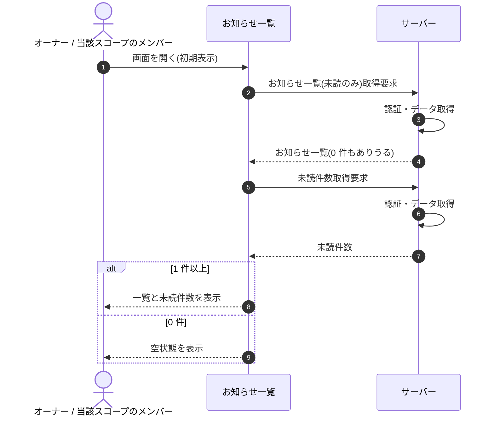

# SEQ-054: 初期表示

> **このページは、業務ユースケース UC-045（初期表示）のシーケンス図を定義します。**

## 項目

| 項目 | 内容 |
|---|---|
| SEQ ID | `SEQ-054` |
| 対応業務ユースケース | [UC-045](../../01_requirements/04_business_usecases/UC-045.md#UC-045) |
| 業務要件 (BR) | [BR-107](../../01_requirements/01_business_requirement/05_notification-br.md#BR-107) ・ [BR-109](../../01_requirements/01_business_requirement/05_notification-br.md#BR-109) ・ [BR-113](../../01_requirements/01_business_requirement/05_notification-br.md#BR-113) |
| 機能要件 (FR) | [FR-155](../../01_requirements/02_functional_requirement/05_notification-fr.md#FR-155) ・ [FR-156](../../01_requirements/02_functional_requirement/05_notification-fr.md#FR-156) |
| 画面イベント (EVT) | EVT-136 |
| 関連画面 | [SCR-016](../01_frontend/01_screens/SCR-016.md#SCR-016) |
| 関連 API | [API-048](../02_backend/03_apis/API-048.md#API-048) ・ [API-051](../02_backend/03_apis/API-051.md#API-051) |
| 関連テーブル | [TBL-010](../02_backend/04_database/TBL-010.md#TBL-010) ・ [TBL-021](../02_backend/04_database/TBL-021.md#TBL-021) |
| エラー (ERR) | — |
| メッセージ (MSG) | — |

## 概要

お知らせ一覧画面を開いたとき、未読のみを既定条件にお知らせ一覧と未読件数を取得して表示する。1 件以上あれば一覧と件数を表示し、0 件のときは空状態を表示する。

## シーケンス図

## 備考

- 本図は基本設計レベルの抽象度(ユーザー / 画面 / サーバー、システム起点は外部システム・スケジューラ・バッチを加える)で記述する。DB 操作はサーバー自己メッセージで表し、テーブル別 CRUD は本図に書かず 関連テーブル 欄で示す。
- 図の出典は業務ユースケース [UC-045](../../01_requirements/04_business_usecases/UC-045.md#UC-045)。画面イベントとの対応は UC-045 を参照。
