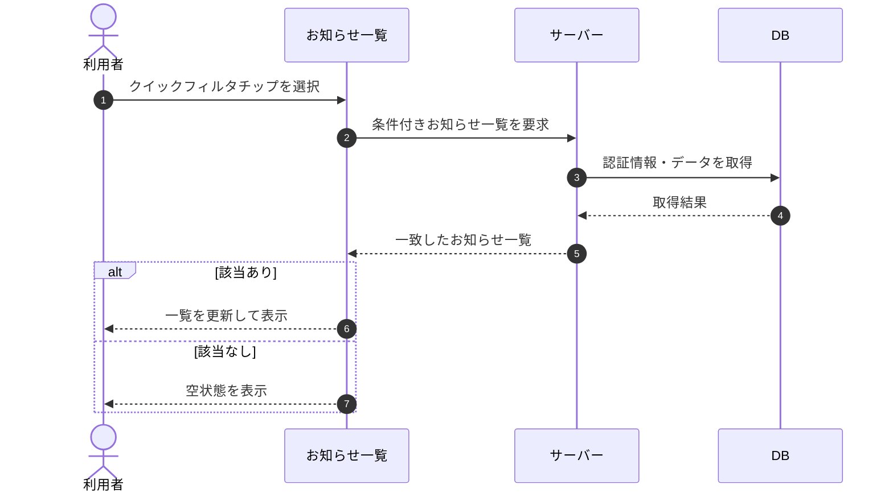

# SEQ-054: クイックフィルタチップを選択

> **このページは、業務ユースケース UC-043（クイックフィルタチップを選択）のシーケンス図を定義します。**

| ID | シーケンス名 |
|----|----|
| SEQ-054 | クイックフィルタチップを選択 |

| 関連項目 | 内容 |
|----|----| 
| 業務ユースケース | [UC-043](../../01_requirements/04_business_usecases/UC-043.md#UC-043) |
| イベント | [SCR-016 EVT-02](../01_frontend/01_screens/SCR-016.md#SCR-016) |
| 関連画面 | [SCR-016](../01_frontend/01_screens/SCR-016.md#SCR-016) |
| 関連API | [API-048](../02_backend/03_apis/API-048.md#API-048) |
| テーブル | [TBL-010](../02_backend/04_database/TBL-010.md#TBL-010) / [TBL-021](../02_backend/04_database/TBL-021.md#TBL-021) |
| エラー(ERR) | — |
| メッセージ(MSG) | — |

## 概要

お知らせ一覧でクイックフィルタチップを選択すると、選択条件に一致するお知らせで一覧を更新する。一致が 0 件のときは空状態を表示する。

## シーケンス図

## 備考

- 本図は基本設計レベルの抽象度(ユーザー / 画面 / サーバー、システム起点は外部システム・スケジューラ・バッチを加える)で記述する。DB 操作は DB アクターへのメッセージで表し、テーブル別 CRUD は本図に書かず 関連テーブル 欄で示す。
- 図の出典は業務ユースケース [UC-043](../../01_requirements/04_business_usecases/UC-043.md#UC-043)。画面イベントとの対応は UC-043 を参照。
